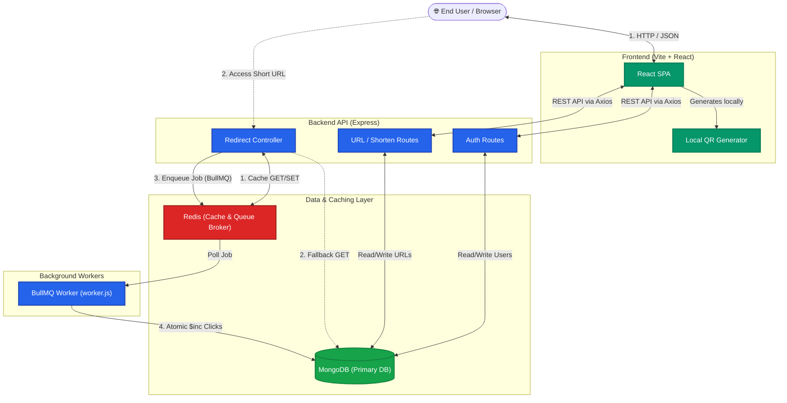

# SwiftLink - Part 1: Architecture Audit & Overview

## Section 0: Resume Audit

This section evaluates each claim on your resume against the provided SwiftLink codebase to verify its implementation status, identify gaps, and highlight undocumented features.

### Bullet 1
> "Built a full-stack URL shortener with JWT-based HTTP-only cookie authentication, bcrypt password hashing, custom aliases for authenticated users, link history, QR-code generation, and a React SPA."

*   **JWT HTTP-only cookie authentication**: ✅ **Fully Implemented**. `authController.js` creates cookies with `httpOnly: true`, `secure: true`, and `sameSite: 'none'`.
*   **Bcrypt password hashing**: ✅ **Fully Implemented**. `models/User.js` utilizes `bcrypt.genSalt` and `bcrypt.hash` inside a `pre('save')` hook, along with a `comparePassword` instance method.
*   **Custom aliases for authenticated users**: ✅ **Fully Implemented**. In `urlController.js`, `createShortUrl` verifies `if (customAlias && !userId)` and rejects unauthorized custom aliases with a 401.
*   **Link history**: ✅ **Fully Implemented**. `Home.jsx` correctly calls `/my-links` to fetch history, with `getUserUrls` querying MongoDB.
*   **QR-code generation**: ✅ **Fully Implemented**. Handled entirely on the client side in `Home.jsx` via `QRCodeGenerator.toDataURL(shortUrl)`.
*   **React SPA**: ✅ **Fully Implemented**. `App.jsx` employs `react-router-dom` for client-side routing.

### Bullet 2
> "Structured the Express backend using MVC separation across controllers, models, middleware, and routes, and containerized the API server, BullMQ worker, Redis, and React frontend as separate Docker Compose services."

*   **MVC Separation**: ✅ **Fully Implemented**. The `backend` directory exhibits a clear MVC layout: `controllers/`, `models/`, `middleware/`, and `routes/`.
*   **Containerization (Docker Compose)**: ✅ **Fully Implemented**. The `docker-compose.yml` cleanly defines 4 services: `redis`, `backend`, `worker`, and `frontend`.

### Bullet 3
> "Implemented a cache-aside strategy using Redis to store serialized URL payloads with a 24-hour TTL, serving redirects from cache on hits and falling back to MongoDB on misses, with graceful handling of Redis failures."

*   **Cache-aside strategy**: ✅ **Fully Implemented**. `redirectToOriginalUrl` checks Redis first, falls back to DB if null, and writes back to Redis.
*   **Serialized URL payloads**: ✅ **Fully Implemented**. Stored as JSON strings: `JSON.stringify({ originalUrl: url.originalUrl, trueId: url.shortId })`.
*   **24-hour TTL**: ✅ **Fully Implemented**. Set natively via `redisClient.set(..., { EX: 86400 })`.
*   **Graceful handling of Redis failures**: ✅ **Fully Implemented**. Both `redisClient.get` and `redisClient.set` are wrapped in `try-catch` blocks that log the error but allow the application to proceed with MongoDB reads/redirects.

### Bullet 4
> "Decoupled click tracking from the redirect path using BullMQ, with retry logic and exponential backoff; an independent worker processes queued jobs and atomically increments click counts in MongoDB."

*   **Decoupled tracking via BullMQ**: ✅ **Fully Implemented**. `analyticsQueue.add("trackClick", ...)` is called asynchronously right before sending the HTTP redirect.
*   **Retry logic and exponential backoff**: ✅ **Fully Implemented**. Configured accurately: `{ attempts: 3, backoff: { type: "exponential", delay: 1000 } }`.
*   **Independent worker**: ✅ **Fully Implemented**. `worker.js` runs as a standalone process (and Docker service) listening to `analyticsQueue`.
*   **Atomically increments click counts**: ✅ **Fully Implemented**. `Url.findOneAndUpdate(..., { $inc: { clicks: 1 } })` ensures atomic operations avoiding race conditions.

### 🚩 Features in Code Not Mentioned in Resume
*   **Guest History Fallback**: The frontend (`Home.jsx`) intelligently falls back to `localStorage` (`"guestUrlHistory"`) when the user is not authenticated.
*   **`nanoid` for collision-resistant short IDs**: The codebase uses `nanoid(7)` for generating base62-like string identifiers cleanly, which is a great talking point for scale.
*   **Active Link Session Persistence**: The frontend stores the last generated short ID and URL in `sessionStorage` (`"activeShortId"`) to recover state on page refreshes.

---

## Section 1: Architecture Overview

**SwiftLink** is a full-stack, distributed URL shortening service. It is designed to take long URLs and compress them into concise aliases, while providing real-time click tracking, user authentication, custom aliases, and QR codes.

### System Architecture
The application follows a decoupled, service-oriented architecture suitable for high-throughput link resolution:

1.  **Frontend (React SPA)**: A Vite-powered React single-page application heavily reliant on React Context API (`AuthContext`) for global state and Axios for API communications. It handles QR code generation locally to offload processing from the server.
2.  **API Gateway / Backend (Node/Express)**: A stateless REST API serving dual purposes: processing write-heavy operations (authentication, URL creation) and read-heavy operations (URL redirection, analytics). It relies on JWTs stored securely in HTTP-only cookies for stateless auth.
3.  **Primary Database (MongoDB)**: Used as the persistent source of truth. Stores User documents and Url documents. Uses sparse indexes to enforce unique `customAlias` values only when they exist.
4.  **Caching Layer (Redis)**: Deployed to absorb the massive read workload of link resolution. Caches the mapping of Short IDs to Original URLs for 24 hours.
5.  **Asynchronous Message Queue (BullMQ + Redis)**: Critical for performance. Capturing analytics (clicks) requires DB writes. By decoupling this process into an asynchronous queue, the API responds with a 302/301 redirect immediately, avoiding blocking the main thread on DB writes.
6.  **Background Worker (Node.js)**: A standalone Node process that consumes the analytics queue. It applies atomic `$inc` operations to MongoDB and implements robust exponential backoff retries for transient failures.

---

## Section 2: Architecture Diagram

---

## Section 3: All Major Flows

### 1. URL Shortening Flow
*   **Trigger**: User submits a URL on `Home.jsx` via `handleShorten()`.
*   **Frontend**: `axios.post('/shorten')` is called. If logged in, sends auth cookies.
*   **Middleware**: `optionalAuth` (`middleware/authMiddleware.js`) attempts to decode JWT. If valid, attaches `req.user`; otherwise sets `req.user = null`.
*   **Controller (`urlController.js -> createShortUrl`)**:
    1. Validates input format (must be HTTP/HTTPS).
    2. Validates user privileges: If `customAlias` is provided, ensures `userId` exists.
    3. Checks MongoDB (`Url.findOne`) for duplicate `customAlias`.
    4. If no custom alias, checks if the exact `originalUrl` was already shortened by this user. If so, returns early.
    5. Generates a short ID using `nanoid(7)`.
    6. Saves to DB: `Url.create({ originalUrl, shortId, shortUrl, customAlias, user })`.
*   **Response**: Returns the created JSON URL object back to the React app.

### 2. URL Redirection Flow (The Hot Path)
*   **Trigger**: Visitor navigates to `http://localhost:5000/:shortId`.
*   **Route**: `GET /:shortId` maps to `redirectToOriginalUrl` in `urlController.js`.
*   **Cache Check**: Calls `redisClient.get(shortId)` (wrapped in a failsafe `try/catch`).
    *   **CACHE HIT Path**:
        1. Parses Redis data (`JSON.parse`).
        2. Fires `analyticsQueue.add("trackClick", { shortId: parsedCache.trueId }, ...)`.
        3. Returns HTTP 302 Redirect to `parsedCache.originalUrl`.
    *   **CACHE MISS Path**:
        1. Queries MongoDB: `Url.findOne({ $or: [{ shortId }, { customAlias: shortId }] })`.
        2. Constructs cache payload and writes to Redis: `redisClient.set(..., { EX: 86400 })`.
        3. Fires `analyticsQueue.add("trackClick", { shortId: url.shortId }, ...)`.
        4. Returns HTTP 302 Redirect to `url.originalUrl`.

### 3. Authentication Flow
*   **Register/Login (`authController.js`)**:
    *   `registerUser` hashes passwords automatically via the Mongoose `pre('save')` hook (`models/User.js`), then creates a user.
    *   `loginUser` validates credentials using `bcrypt.compare`.
    *   Both generate a JWT (`generateToken`) and set it via `res.cookie('token', token, { httpOnly: true, secure: true, maxAge: 7 days })`.
*   **Session Check (`GET /api/auth/me`)**:
    *   Runs through `protect` middleware (`authMiddleware.js`).
    *   Verifies the `token` cookie with `jwt.verify`.
    *   Fetches the user minus the password (`select('-password')`).
    *   React `AuthContext` uses this on initial load to set the global `user` state.
*   **Logout (`POST /api/auth/logout`)**:
    *   Overwrites the token cookie with an expired date (`expires: new Date(0)`).

### 4. Click Tracking Flow (Async Architecture)
*   **Producer**: Inside `redirectToOriginalUrl`, a job is added to the BullMQ instance `analyticsQueue` with exponential backoff configurations.
*   **Broker**: The job payload (e.g., `{ shortId: "abc1234" }`) is stored in Redis. The Express thread is immediately freed up.
*   **Consumer (`worker.js`)**:
    1. Instantiates a new `Worker("analyticsQueue")` connecting to Redis.
    2. Picks up the job.
    3. Runs `Url.findOneAndUpdate({ shortId }, { $inc: { clicks: 1 } })` to atomically increment the Mongo document.
    4. Handles failures natively through BullMQ's retry logic.

### 5. Link History Flow
*   **Authenticated Users**:
    *   React mounts `Home.jsx` -> `useEffect` calls `fetchHistory`.
    *   Sends `GET /my-links` with cookies.
    *   `protect` middleware validates JWT.
    *   `getUserUrls` runs `Url.find({ user: req.user._id }).sort({ createdAt: -1 })`.
*   **Guest Users**:
    *   Frontend fails to find user context.
    *   Reads `localStorage.getItem("guestUrlHistory")`.

### 6. QR Code Generation Flow
*   **Trigger**: A URL is successfully shortened or restored from `sessionStorage` in `Home.jsx`.
*   **Generation**: The frontend invokes `QRCodeGenerator.toDataURL(shortUrl)`.
*   **Output**: A base64 image data string is generated completely client-side.
*   **Rendering**: The React component renders `` without requiring any server-side graphic processing.

---

# SwiftLink Interview Preparation - Part 2 (P1 & P2 Questions)

## Priority 1 — Must Know

### Q1. What is SwiftLink?
**Priority:** P1
**Topic:** Project Overview
**Why an interviewer asks this:** To see if you can concisely pitch your project, explain its core value proposition, and highlight the main technical achievements.

**Interview-ready answer:**
SwiftLink is a full-stack URL shortener built with the MERN stack. It allows users to convert long URLs into short, trackable links. Key features include user authentication, custom aliases, Redis caching for fast redirects, and asynchronous background click-tracking using BullMQ to ensure high performance under load.

**Detailed explanation:**
SwiftLink addresses the problem of sharing long, unwieldy URLs by generating compact links. The architecture is designed for scale: instead of hitting the database on every redirect, it uses a cache-aside pattern with Redis. To prevent redirect delays, analytics (click tracking) are decoupled from the main request lifecycle using a BullMQ background worker. It supports both guest users (with localStorage history) and authenticated users (with DB-backed history and custom alias capabilities).

**My implementation:**
- Frontend: React 19, Vite, TailwindCSS, DaisyUI
- Backend: Node.js, Express 5, MongoDB, Mongoose
- Caching/Queues: Redis, BullMQ
- Deployment: Docker Compose for local orchestration, cloud Atlas for DB.

**Possible follow-up questions:**
1. What was the most challenging part of building this?
2. Why did you choose the MERN stack over others?
3. How would you scale this to handle 10,000 redirects per second?

**Follow-up answers:**
1. Decoupling the analytics using BullMQ. I had to ensure the redirect still happens immediately while the worker reliably processes the click count in the background without blocking the main event loop.
2. The MERN stack provides a unified language (JavaScript) across the stack. MongoDB's flexible schema easily accommodates the `Url` model, especially the sparse index on custom aliases.
3. I would scale horizontally by spinning up multiple backend Node.js instances behind a load balancer, run multiple BullMQ worker instances, and use a Redis cluster for distributed caching.

**Common mistake to avoid:**
Do not describe it merely as a "tutorial project" or focus only on the basic shortening. Always highlight the performance optimizations (Redis, BullMQ).

---

### Q2. How does URL shortening work in your application?
**Priority:** P1
**Topic:** Core Functionality
**Why an interviewer asks this:** To understand your core domain logic and how you generate unique identifiers.

**Interview-ready answer:**
When a user submits a URL, I validate it and generate a 7-character unique ID using the `nanoid` library. For logged-in users, they can optionally provide a custom alias. The original URL, the unique ID (or alias), and the generated short link are then stored in MongoDB.

**Detailed explanation:**
The shortening process begins in the controller. First, basic validation ensures the input is a valid HTTP/HTTPS URL using the native `URL` constructor. If no custom alias is provided, `nanoid(7)` generates a random string with a very low collision probability. To optimize storage for non-alias links, I check if the user has already shortened this exact `originalUrl` using a `findOne` query. Finally, I combine the `BASE_URL` with the identifier to form the `shortUrl` and save the document to MongoDB. 

**My implementation:**
- File: `backend/controllers/urlController.js`
- Function: `createShortUrl`
- Dependencies: `nanoid` (for ID generation).

**Possible follow-up questions:**
1. Why use `nanoid` instead of UUID or base62 encoding?
2. What happens if `nanoid(7)` generates a collision?
3. How do you handle duplicate URLs submitted by the same user?

**Follow-up answers:**
1. `nanoid` is faster and more compact than UUID, and generates URL-friendly strings out of the box, whereas UUIDs are too long (36 chars) for a short URL.
2. In the current implementation, MongoDB enforces a unique constraint on the `shortId` field. A collision would throw a database error (E11000). To improve this, I could add a retry loop in the application layer if a collision error occurs.
3. The code checks `Url.findOne({originalUrl, user})` for non-custom alias requests and returns the existing short link instead of creating a new one, saving DB space.

**Common mistake to avoid:**
Claiming you implemented a custom base62 encoder if you simply used the `nanoid` package. Be honest about using the library.

---

### Q3. How does redirection work in your application?
**Priority:** P1
**Topic:** System Design / Request Flow
**Why an interviewer asks this:** To see if you understand the critical path of the application—the read flow, which gets the most traffic.

**Interview-ready answer:**
When a user visits a short link, the server extracts the ID from the URL parameters and checks Redis. If there's a cache hit, it redirects immediately and pushes an analytics job to a BullMQ queue. On a cache miss, it queries MongoDB, caches the result in Redis with a 24-hour TTL, queues the analytics job, and then redirects the user.

**Detailed explanation:**
The redirect endpoint is a `GET /:shortId` route. The `redirectToOriginalUrl` controller implements a cache-aside pattern. It first attempts `redisClient.get(shortId)`. If found, it parses the JSON to get the original URL. If not found, it queries MongoDB using an `$or` operator to match either the `shortId` or `customAlias`. It then sets the data in Redis using `SETEX` (24 hours). Before sending the 302 redirect response, it offloads the click-tracking by adding a job to the `analyticsQueue`.

**My implementation:**
- File: `backend/controllers/urlController.js`
- Function: `redirectToOriginalUrl`
- Route: `GET /:shortId` (in `backend/routes/url.js`)

**Possible follow-up questions:**
1. What HTTP status code do you use for redirects and why?
2. Why queue the analytics before sending the redirect instead of after?
3. How is the Redis payload structured?

**Follow-up answers:**
1. I use 302 (Found/Temporary Redirect) by default (implied by Express `res.redirect`). A 301 (Permanent Redirect) would cause browsers to cache the redirect locally, which would bypass my server entirely and break click tracking.
2. In Express, you can execute code after `res.redirect()`, but pushing to the BullMQ queue is extremely fast (just a Redis command). Doing it right before the redirect ensures the tracking job is safely enqueued without noticeably delaying the response.
3. The Redis payload is a JSON string containing the `originalUrl` and the `trueId` (which resolves the customAlias to the internal shortId for consistent tracking).

**Common mistake to avoid:**
Forgetting to mention the $or query for custom aliases, or confusing 301 vs 302 redirects in the context of analytics tracking.

---

### Q4. Why use Redis? What is the cache-aside pattern?
**Priority:** P1
**Topic:** Caching
**Why an interviewer asks this:** To test your understanding of performance optimization and standard caching strategies.

**Interview-ready answer:**
I use Redis because URL redirection is a read-heavy operation. Hitting MongoDB for every redirect would create a bottleneck. Redis stores the mapping in fast, in-memory storage. The cache-aside pattern means the application code manages the cache: it checks the cache first, and only on a miss does it query the DB and populate the cache.

**Detailed explanation:**
In a URL shortener, the read-to-write ratio is extremely high. Redis operates in memory, providing sub-millisecond response times compared to disk-backed MongoDB queries. Cache-aside (or lazy loading) is implemented in `redirectToOriginalUrl`. The app is responsible for orchestrating the flow: 
1. Ask Redis.
2. If hit, return data.
3. If miss, ask MongoDB.
4. If found in MongoDB, write to Redis.
5. Return data.

**My implementation:**
- File: `backend/controllers/urlController.js` inside `redirectToOriginalUrl`
- Redis Client: `node-redis` package connected in `backend/config/redis.js`

**Possible follow-up questions:**
1. What is the downside of the cache-aside pattern?
2. Are there other caching patterns you considered?
3. How do you handle cache invalidation in your application?

**Follow-up answers:**
1. The main downside is that a cache miss results in a latency penalty because the app has to make two network calls (Redis, then DB) and a third to populate the cache.
2. Write-through caching (writing to DB and cache simultaneously during creation) is an alternative. I stuck with cache-aside to save memory, only caching URLs that are actively being visited.
3. Currently, URLs in SwiftLink cannot be edited or deleted by the user, so explicit cache invalidation isn't strictly necessary. The data is immutable, so the cache just expires via TTL.

**Common mistake to avoid:**
Saying Redis automatically syncs with MongoDB. You must explicitly state that the *application server* bridges the two data stores.

---

### Q5. What happens on a cache hit versus a cache miss?
**Priority:** P1
**Topic:** Caching Mechanics
**Why an interviewer asks this:** To ensure you understand the exact flow and edge cases of your caching logic.

**Interview-ready answer:**
On a cache hit, the app parses the URL from Redis, pushes a click-tracking job to BullMQ, and immediately redirects. On a cache miss, the app queries MongoDB. If the URL exists, it saves it to Redis with a TTL, pushes the tracking job, and redirects. If it doesn't exist in MongoDB, it returns a 404 error.

**Detailed explanation:**
A cache hit avoids the database entirely. The Redis payload stores a JSON string like `{"originalUrl": "...", "trueId": "..."}`. On a hit, `JSON.parse` is used to extract these values. The `trueId` is used for analytics to ensure clicks on a custom alias increment the correct underlying record. On a cache miss, the database is queried. If the record is found, `redisClient.set(..., { EX: 86400 })` caches it.

**My implementation:**
- File: `backend/controllers/urlController.js` inside `redirectToOriginalUrl`.

**Possible follow-up questions:**
1. Why do you need `trueId` in the cache payload?
2. What if parsing the JSON from Redis fails?
3. Does querying Redis block the event loop?

**Follow-up answers:**
1. A user might access the link via `customAlias`, but the DB tracks clicks using the internal `shortId`. The cache stores `trueId` so the analytics worker always increments using the primary `shortId`, keeping tracking unified.
2. If `JSON.parse` fails, the `try/catch` block catches it. In my implementation, a cache error logs the error and gracefully falls back to querying the database, ensuring the user is still redirected.
3. No, Redis commands are asynchronous I/O operations and do not block the Node.js event loop.

**Common mistake to avoid:**
Assuming the cache payload is just a plain string. In this project, it's a JSON object to hold both the URL and the tracking ID.

---

### Q6. What is the TTL and why 24 hours?
**Priority:** P1
**Topic:** Cache Management
**Why an interviewer asks this:** To evaluate your reasoning behind configuration values and resource management.

**Interview-ready answer:**
TTL stands for Time-To-Live. I set it to 24 hours (86,400 seconds) so that active links remain fast in the cache, but stale or unused links eventually expire, freeing up precious Redis memory.

**Detailed explanation:**
Memory in Redis is expensive compared to disk storage. If I cached every link forever, Redis would eventually run out of memory (OOM). A 24-hour TTL leverages the temporal locality of URL shortening—links are usually clicked heavily shortly after creation, then traffic dies down. If a link becomes viral again after expiring, it simply causes a single cache miss, queries MongoDB, and is cached for another 24 hours.

**My implementation:**
- File: `backend/controllers/urlController.js`
- Command: `redisClient.set(redisKey, JSON.stringify(cacheData), { EX: 86400 });`

**Possible follow-up questions:**
1. What happens when Redis runs out of memory?
2. Could you use an eviction policy instead of TTL?
3. How would you determine if 24 hours is the right amount of time?

**Follow-up answers:**
1. Depending on its configuration, Redis might start rejecting write operations, crash, or evict keys.
2. Yes, I could configure Redis with an eviction policy like `allkeys-lru` (Least Recently Used) to automatically delete the oldest keys when memory is full, but setting an explicit TTL is a safer, proactive baseline.
3. I would monitor cache hit/miss rates and memory usage in production. If the hit rate is low, I might increase the TTL; if memory is maxing out, I might decrease it.

**Common mistake to avoid:**
Stating that TTL deletes the record from MongoDB. TTL only removes the key from the Redis cache.

---

### Q7. What happens if Redis is down?
**Priority:** P1
**Topic:** System Resiliency / Error Handling
**Why an interviewer asks this:** To test your knowledge of fault tolerance and graceful degradation.

**Interview-ready answer:**
If Redis is down, the application gracefully degrades. The errors from Redis commands are caught, and the application falls back to querying MongoDB directly. The redirect still works, it just takes slightly longer.

**Detailed explanation:**
In my `redirectToOriginalUrl` controller, the Redis operations (`get` and `set`) are wrapped in `try/catch` blocks (or the errors are handled seamlessly). Because the database is the source of truth, a Redis connection failure doesn't break the core functionality. I designed the system so that Redis is treated as a progressive enhancement. However, note that if Redis is down, BullMQ will also fail to enqueue analytics jobs, as it relies on Redis.

**My implementation:**
- File: `backend/controllers/urlController.js`
- File: `backend/config/redis.js` logs connection errors without calling `process.exit()`.

**Possible follow-up questions:**
1. Is it a problem if the database suddenly gets all the traffic?
2. How does BullMQ handle a Redis outage?
3. What is the "thundering herd" problem?

**Follow-up answers:**
1. Yes, if Redis fails during a high-traffic spike, the sudden load on MongoDB could overwhelm the database.
2. BullMQ requires Redis to function. If Redis is down, adding jobs to the queue will throw an error. In my implementation, I would need a try/catch around the `analyticsQueue.add` call to ensure the redirect doesn't fail if the queue is unavailable.
3. The thundering herd problem occurs when a highly requested cache key expires, and hundreds of concurrent requests all hit the database simultaneously to rebuild the cache before the first one finishes setting it.

**Common mistake to avoid:**
Claiming the application will crash. The backend explicitly avoids `process.exit()` on Redis connection errors in `config/redis.js`.

---

### Q8. Why BullMQ? Why decouple click tracking?
**Priority:** P1
**Topic:** Asynchronous Processing / Message Queues
**Why an interviewer asks this:** To see if you understand the benefits of message queues for non-blocking background tasks.

**Interview-ready answer:**
Updating a click counter in the database takes time. If I wait for the database update to finish before redirecting the user, it slows down the user experience. By using BullMQ, I offload the click tracking to a background worker. The redirect happens instantly, and the worker updates the database asynchronously.

**Detailed explanation:**
Updating MongoDB requires a write operation (`$inc`). Writes are generally slower than reads and hold database locks. By decoupling this, the Express server acts as a producer, pushing a lightweight job `{ shortId }` to the Redis-backed BullMQ queue. The response is sent to the client immediately. A separate worker process consumes these jobs and performs the actual MongoDB update. This improves the response time of the API and allows the system to handle bursts of traffic by queuing the writes and processing them at a steady rate.

**My implementation:**
- Queue Setup: `backend/controllers/urlController.js` (`analyticsQueue.add`)
- Worker: `backend/worker.js`

**Possible follow-up questions:**
1. Why use BullMQ instead of just not `await`ing the database call in Express?
2. What happens to the jobs if the worker crashes?
3. Does BullMQ use the same Redis instance as the cache?

**Follow-up answers:**
1. If I just omit `await` (fire-and-forget), an unhandled promise rejection could crash the server if the DB fails. More importantly, if the Express server restarts, all pending in-memory database calls are permanently lost. BullMQ persists jobs in Redis, ensuring they are eventually processed.
2. Because the jobs are stored in Redis, they remain in the queue. When the worker restarts, it picks up exactly where it left off.
3. In this architecture, yes, both the cache and BullMQ share the same Redis instance, though BullMQ establishes its own connection using `ioredis` under the hood.

**Common mistake to avoid:**
Confusing the cache and the queue. Redis acts as the datastore for *both*, but they serve totally different purposes (read speed vs. background processing).

---

### Q9. How does the BullMQ worker process jobs?
**Priority:** P1
**Topic:** Worker Architecture
**Why an interviewer asks this:** To ensure you understand the consumer side of the message queue pattern.

**Interview-ready answer:**
The worker is a separate Node.js process that listens to the `analyticsQueue` in Redis. When it receives a job, it extracts the `shortId`, connects to MongoDB, and runs an atomic `$inc` operation to increment the clicks. If the database update fails, the worker throws an error so BullMQ knows to retry the job.

**Detailed explanation:**
The worker runs independently (`node worker.js`). It creates its own Mongoose connection. It instantiates a BullMQ `Worker` class, passing the queue name and a processing function. The function receives the `job` object, accesses `job.data.shortId`, and executes `Url.findOneAndUpdate({ shortId }, { $inc: { clicks: 1 } })`. Crucially, if the DB query fails, the function throws an error. This signals to BullMQ that the job failed, triggering its built-in retry mechanism.

**My implementation:**
- File: `backend/worker.js`
- Operation: `Url.findOneAndUpdate` with `$inc`

**Possible follow-up questions:**
1. Why does the worker need its own database connection?
2. Can you run multiple workers?
3. How is the worker deployed in Docker?

**Follow-up answers:**
1. Because it runs as a completely separate Node.js process. It doesn't share memory or connections with the Express API server.
2. Yes, because BullMQ handles distributed locking in Redis, I could spin up 5 worker processes, and they would safely pull jobs off the queue without duplicating work.
3. In `docker-compose.yml`, the worker is a separate service built from the same backend image, but its command is overridden to `node worker.js` instead of starting the Express server.

**Common mistake to avoid:**
Thinking the worker runs inside the Express app. It is a completely distinct process.

---

### Q10. What is exponential backoff?
**Priority:** P1
**Topic:** Resiliency / Queues
**Why an interviewer asks this:** To test your understanding of distributed systems failure handling.

**Interview-ready answer:**
Exponential backoff is a retry strategy. If a background job fails, the system waits a short time before retrying. If it fails again, the wait time doubles (or increases exponentially). This prevents the worker from overwhelming a struggling database with rapid-fire retries.

**Detailed explanation:**
When I add a job to BullMQ in the controller, I configure it with `{ attempts: 3, backoff: { type: 'exponential', delay: 1000 } }`. If the DB is temporarily down, the worker throws an error. BullMQ waits 1 second, then retries. If it fails again, it waits 2 seconds, then 4 seconds. This gives the downstream system (MongoDB) time to recover instead of bombarding it with requests, which would only make an outage worse.

**My implementation:**
- File: `backend/controllers/urlController.js`
- Logic: Passed in the options object of `analyticsQueue.add()`

**Possible follow-up questions:**
1. Where is the retry configuration defined—in the queue or the worker?
2. What happens after the maximum attempts are reached?
3. What causes a job to fail in your setup?

**Follow-up answers:**
1. In this project, it is defined on the *producer* side when adding the job (`queue.add`), not on the worker side.
2. The job is marked as "failed" and moved to a failed set in Redis. It will not be retried again automatically.
3. Usually a MongoDB connection issue or a timeout when trying to execute the `findOneAndUpdate` query.

**Common mistake to avoid:**
Stating that exponential backoff is a MongoDB feature. It is a BullMQ feature.

---

### Q11. How does JWT authentication work in your app?
**Priority:** P1
**Topic:** Security / Authentication
**Why an interviewer asks this:** To verify you understand stateless authentication and token lifecycles.

**Interview-ready answer:**
When a user logs in, the backend signs a JSON Web Token (JWT) containing their user ID using a secret key. This token is sent to the client in an HTTP-only cookie. On subsequent requests, the `protect` middleware reads the token from the cookie, verifies the signature, and attaches the user object to the request.

**Detailed explanation:**
I use the `jsonwebtoken` package. The `generateToken` helper creates a token with `jwt.sign({ id }, process.env.JWT_SECRET)`. By storing the token in an `httpOnly` cookie rather than returning it in the JSON body, I protect the application against Cross-Site Scripting (XSS) attacks, as JavaScript cannot access the cookie. The `protect` middleware extracts `req.cookies.token`, verifies it, and does a `User.findById(decoded.id)` to populate `req.user`.

**My implementation:**
- Generation: `generateToken` in `backend/controllers/authController.js`
- Validation: `protect` and `optionalAuth` in `backend/middleware/authMiddleware.js`

**Possible follow-up questions:**
1. Why include the user ID in the token instead of the whole user object?
2. What happens if the JWT secret is compromised?
3. How do you log a user out?

**Follow-up answers:**
1. JWTs are encoded, not encrypted. Anyone can decode a JWT and read the payload. Keeping the payload minimal (just the ID) ensures no sensitive data is exposed, and it keeps the token size small.
2. An attacker could forge valid tokens for any user. I would need to immediately change the secret key, which would instantly invalidate all existing tokens, forcing everyone to log in again.
3. The logout route clears the cookie by setting it to an empty string and assigning an expiration date in the past (`new Date(0)`).

**Common mistake to avoid:**
Confusing encoding with encryption. JWTs (by default) are Base64 encoded and signed, but the payload is readable by anyone.

---

### Q12. Why HTTP-only cookies? Why not localStorage?
**Priority:** P1
**Topic:** Security
**Why an interviewer asks this:** This is a classic security question to see if you understand XSS and token storage trade-offs.

**Interview-ready answer:**
I chose HTTP-only cookies because they cannot be accessed by client-side JavaScript. If I stored the JWT in `localStorage`, a malicious script (XSS) could easily read the token and hijack the user's session. HTTP-only cookies are sent automatically by the browser with every request, keeping the token secure.

**Detailed explanation:**
When `registerUser` or `loginUser` completes, `res.cookie` is called with the `httpOnly: true` flag. This guarantees the browser hides the cookie from `document.cookie`. Additionally, I set `secure: true` (ensuring it's only sent over HTTPS) and `sameSite: 'none'` (allowing cross-origin requests, which is required since my React frontend and Express backend are hosted on different domains).

**My implementation:**
- File: `backend/controllers/authController.js`
- Configuration: `res.cookie('token', token, { httpOnly: true, secure: true, sameSite: 'none', maxAge: 7 * 24 * 60 * 60 * 1000 })`

**Possible follow-up questions:**
1. If HTTP-only cookies prevent XSS, are there other vulnerabilities they introduce?
2. How does the frontend know if the user is authenticated if it can't read the cookie?
3. Why `sameSite: 'none'`?

**Follow-up answers:**
1. Yes, using cookies makes the application susceptible to Cross-Site Request Forgery (CSRF). An attacker could trick a user's browser into making an authenticated request.
2. The frontend makes an API call to `GET /api/auth/me`. The browser attaches the cookie automatically. If the token is valid, the backend returns the user data, which the frontend stores in React state/Context.
3. Because the frontend (e.g., Vercel/Netlify) and backend (e.g., Render/Heroku) are on different domains. `sameSite: 'none'` tells the browser to send the cookie across domains, but it requires `secure: true` to work.

**Common mistake to avoid:**
Claiming HTTP-only cookies solve all security problems. You must acknowledge the trade-off (protection against XSS at the risk of CSRF).

---

### Q13. How does bcrypt password hashing work?
**Priority:** P1
**Topic:** Security / Data Modeling
**Why an interviewer asks this:** To verify you don't store plain-text passwords and understand basic cryptography principles in Node.

**Interview-ready answer:**
I use `bcrypt` to hash user passwords before saving them to the database. It generates a random "salt" and combines it with the password before hashing. This ensures that even if two users have the same password, their hashes look entirely different, protecting against rainbow table attacks.

**Detailed explanation:**
Hashing is a one-way mathematical function. I implemented this using a Mongoose `pre('save')` hook on the User model. Before a user is saved, if the password was modified, I run `bcrypt.genSalt(10)` and then `bcrypt.hash(password, salt)`. For login, the `comparePassword` instance method uses `bcrypt.compare()` to hash the incoming login password and check if it matches the stored hash.

**My implementation:**
- File: `backend/models/User.js`
- Hooks: `userSchema.pre('save')` and `userSchema.methods.comparePassword`

**Possible follow-up questions:**
1. Why check `this.isModified('password')` in the hook?
2. What does the `10` in `genSalt(10)` mean?
3. Why not use standard SHA-256?

**Follow-up answers:**
1. If a user updates their email but not their password, the `pre('save')` hook still runs. If I didn't check `isModified`, I would end up hashing the already-hashed password, locking the user out.
2. It represents the "cost factor" or the number of hashing rounds (2^10). A higher number makes it exponentially slower, making brute-force attacks unfeasible.
3. SHA-256 is too fast. Attackers using GPUs can calculate billions of SHA-256 hashes per second. Bcrypt is intentionally slow and CPU-intensive to thwart brute-forcing.

**Common mistake to avoid:**
Calling it "encryption." Encryption is two-way (can be decrypted). Hashing is one-way. Passwords are hashed, not encrypted.

---

### Q14. How do custom aliases work?
**Priority:** P1
**Topic:** Core Feature / DB Modeling
**Why an interviewer asks this:** To test your ability to implement conditional logic and database constraints.

**Interview-ready answer:**
Logged-in users can provide a custom alias instead of a randomly generated string (e.g., `swiftlink.com/my-portfolio`). The backend checks if the user is authenticated, validates the alias format, and queries the database to ensure the alias isn't already taken before saving it.

**Detailed explanation:**
In `createShortUrl`, the `optionalAuth` middleware allows the route to identify if a user is present. If `req.body.customAlias` exists, I first enforce that `req.user` is not null (returning 401 if a guest tries it). I then check `Url.findOne({ customAlias })` to manually prevent duplicates before insertion. The DB also enforces a unique index. The final redirect URL is constructed using the alias instead of the generated `shortId`.

**My implementation:**
- File: `backend/controllers/urlController.js` (`createShortUrl` function)
- Validation: Regex checking `/^[a-zA-Z0-9-_]+$/` in the Mongoose model.

**Possible follow-up questions:**
1. How does the routing handle requests to custom aliases versus random IDs?
2. What happens if a user inputs a custom alias containing spaces or special characters?
3. Why query `Url.findOne` manually if the DB has a unique constraint?

**Follow-up answers:**
1. The `GET /:shortId` route handles both. The database query uses an `$or` operator: `$or: [{ shortId: id }, { customAlias: id }]`. This allows the exact same logic to handle both types of links.
2. The Mongoose model includes a regex `match` validator. It will throw a validation error, which the controller sends back to the frontend to display to the user.
3. Querying manually allows me to provide a friendly, specific error message ("Alias is already taken") rather than trying to parse a generic MongoDB E11000 duplicate key error.

**Common mistake to avoid:**
Not mentioning the regex validation. Security-wise, allowing arbitrary strings in URLs can lead to path traversal or encoding issues.

---

### Q15. What is the sparse unique index on customAlias?
**Priority:** P1
**Topic:** MongoDB / Databases
**Why an interviewer asks this:** This highlights an advanced MongoDB feature that is essential for optional unique fields.

**Interview-ready answer:**
Because most links are randomly generated and don't have a custom alias, the `customAlias` field is often undefined. A standard unique index in MongoDB only allows one document to have a null/undefined value. A `sparse` index ignores documents where the field is missing, allowing me to enforce uniqueness only when a custom alias is actually provided.

**Detailed explanation:**
In the Mongoose `Url` schema, I defined `customAlias: { type: String, unique: true, sparse: true }`. Without `sparse: true`, the first guest user creates a link, and `customAlias` is omitted (treated as `null`). When the second guest tries to create a link, MongoDB throws a duplicate key error because `null` is already taken. The sparse index tells MongoDB, "Only include documents in this index if the `customAlias` field exists."

**My implementation:**
- File: `backend/models/Url.js`

**Possible follow-up questions:**
1. What is the difference between `sparse: true` and a partial index?
2. Can multiple users claim the same original URL but with different aliases?
3. How do you handle empty strings in `customAlias`?

**Follow-up answers:**
1. A sparse index simply excludes missing fields. A partial index is more powerful; it allows you to define a specific filter expression (e.g., index only documents where `clicks > 10`).
2. Yes, the unique constraint is on the alias, not the combination of user and original URL. Two different aliases pointing to the same site create two separate DB records.
3. Mongoose handles this with `trim: true`. If a user passes an empty string, I could add logic to treat it as undefined, ensuring it doesn't trigger a unique constraint violation for empty strings.

**Common mistake to avoid:**
Confusing sparse indexes with compound indexes.

---

### Q16. What is the difference between protect and optionalAuth middleware?
**Priority:** P1
**Topic:** Express Middleware
**Why an interviewer asks this:** To see if you understand how middleware controls access and request decoration.

**Interview-ready answer:**
The `protect` middleware is strict: it requires a valid token. If missing or invalid, it blocks the request and returns a 401 error. `optionalAuth` is lenient: it checks for a token, and if valid, attaches the user to the request. But if the token is missing or invalid, it simply sets `req.user = null` and allows the request to continue.

**Detailed explanation:**
In SwiftLink, the core link creation endpoint (`POST /shorten`) is accessible to both guests and authenticated users. Using `optionalAuth` on this route allows me to gracefully handle both. If `req.user` exists, I can associate the shortened URL with that user's account and allow custom aliases. Routes like `GET /my-links` use the strict `protect` middleware because guests shouldn't access a dashboard.

**My implementation:**
- File: `backend/middleware/authMiddleware.js`
- Functions: `protect` and `optionalAuth`

**Possible follow-up questions:**
1. Where does the user object come from after the token is verified?
2. Why not just use `protect` and have a separate route for guests?
3. Does `optionalAuth` handle expired tokens differently?

**Follow-up answers:**
1. Once `jwt.verify` decodes the token, the middleware queries the database: `User.findById(decoded.id).select('-password')`, and attaches the result to `req.user`.
2. Having separate routes (`/shorten/guest` and `/shorten/user`) duplicates controller logic. A single endpoint with optional auth is cleaner and more RESTful.
3. No, if `jwt.verify` throws an error (e.g., TokenExpiredError), `optionalAuth` catches it, sets `req.user = null`, and calls `next()`, treating the user as a guest.

**Common mistake to avoid:**
Forgetting to call `next()` in the catch block of `optionalAuth`, which would cause the request to hang indefinitely.

---

### Q17. What does Docker Compose do in your project?
**Priority:** P1
**Topic:** DevOps / Containerization
**Why an interviewer asks this:** To test your local development workflow and understanding of multi-container orchestration.

**Interview-ready answer:**
Docker Compose allows me to define and run multi-container applications. In SwiftLink, it orchestrates four services simultaneously: the Redis container, the Express backend, the BullMQ worker process, and the Vite frontend, linking them together in an isolated local network.

**Detailed explanation:**
Instead of manually starting Redis, starting the backend in one terminal, the worker in another, and the frontend in a fourth, I defined a `docker-compose.yml` file. A single `docker-compose up` command builds the images, sets up networking, and passes the correct environment variables. For example, it ensures the backend and worker can communicate with the Redis service via the hostname `redis` instead of `localhost`.

**My implementation:**
- File: `docker-compose.yml`
- Services defined: `redis` (alpine image), `backend` (builds from ./backend), `worker` (builds from ./backend, overrides command), `frontend` (builds from ./frontend).

**Possible follow-up questions:**
1. Why is MongoDB not in the Docker Compose file?
2. How does the backend find the Redis container?
3. Why do the backend and worker use the same build context?

**Follow-up answers:**
1. I rely on MongoDB Atlas (a cloud database) for both local development and production. Putting a stateful database in local Docker requires managing volumes and makes seeding data more complex for a simple project.
2. Docker Compose automatically creates a custom bridge network and provides internal DNS. The backend connects using the service name defined in the YAML file (e.g., `redis://redis:6379`).
3. They use the exact same Node.js environment, `package.json`, and source code. The only difference is the entry file they execute (`server.js` vs `worker.js`).

**Common mistake to avoid:**
Claiming Docker Compose is used for production deployment. Compose is primarily for local dev and testing; production usually uses Kubernetes or PaaS (like Render/AWS ECS).

---

### Q18. Explain the MVC structure of your backend.
**Priority:** P1
**Topic:** Architecture / Project Structure
**Why an interviewer asks this:** To evaluate your code organization and separation of concerns.

**Interview-ready answer:**
My Express backend follows the Model-View-Controller (MVC) architecture, though without standard "Views" since React handles the frontend. Models define the MongoDB schemas and data logic. Routes define the API endpoints. Controllers handle the business logic connecting the routes to the models.

**Detailed explanation:**
By separating concerns, the code is highly maintainable.
- **Models** (`backend/models/`): Mongoose schemas (`User.js`, `Url.js`) dictate data structure, validation, and hooks (like bcrypt password hashing).
- **Controllers** (`backend/controllers/`): Contain the logic. For example, `urlController.js` handles cache lookups, validations, and database inserts.
- **Routes** (`backend/routes/`): Simple files that map HTTP verbs and paths (`POST /shorten`) to specific controller functions and middleware.
- **Middleware**: Intercepts requests (like authentication) before reaching controllers.

**My implementation:**
- Full backend folder structure follows this strictly.

**Possible follow-up questions:**
1. Where do you put business logic: the model or the controller?
2. What are the benefits of this structure over putting everything in `server.js`?
3. Where does the Redis logic fit in MVC?

**Follow-up answers:**
1. It's best to put database-centric logic in the Model (like the pre-save hook for hashing passwords) and application logic in the Controller (like generating short URLs). This prevents fat controllers.
2. Putting everything in `server.js` becomes unreadable and impossible to test. MVC isolates dependencies, making it easier to mock and test individual pieces.
3. The Redis setup is placed in a `config/` directory, while the actual cache interaction happens in the controllers, acting as a data-access layer alongside the models.

**Common mistake to avoid:**
Saying React is the "View" in backend MVC. React is a completely separate client application. The backend is technically an API, not a strict MVC with views.

---

## Priority 2 — Very Important

### Q19. How does the redirect handle both shortId and customAlias?
**Priority:** P2
**Topic:** Database Querying
**Why an interviewer asks this:** To check your knowledge of MongoDB query operators.

**Interview-ready answer:**
The redirect endpoint receives a parameter from the URL (`/:shortId`). Because this string could be an auto-generated ID OR a custom alias, I use the MongoDB `$or` operator in the `findOne` query to search both the `shortId` and `customAlias` fields simultaneously.

**Detailed explanation:**
In `urlController.js`, a user visiting `swiftlink.com/my-portfolio` sends `my-portfolio` as the param. The controller queries `Url.findOne({ $or: [{ shortId: id }, { customAlias: id }] })`. If it matches either field, the document is returned. This elegantly allows one API route to handle two distinctly different types of identifiers without needing special prefixes in the URL.

**My implementation:**
- File: `backend/controllers/urlController.js` (`redirectToOriginalUrl`)

---

### Q20. What is the Redis cache payload structure and why?
**Priority:** P2
**Topic:** Data Structures / Caching
**Why an interviewer asks this:** To see if you understand the data requirements for asynchronous tracking.

**Interview-ready answer:**
The cached payload is a stringified JSON object containing both the `originalUrl` and the `trueId` (the internal `shortId`). I need `trueId` so the background worker increments the correct database record even if the user visited the link using a custom alias.

**Detailed explanation:**
If a URL has `shortId: "xyz123"` and `customAlias: "portfolio"`, a user visiting `/portfolio` hits the cache. If I only cached the original URL, the analytics worker would only have "portfolio". By caching `{ originalUrl: "...", trueId: "xyz123" }`, I can immediately redirect the user AND pass "xyz123" to BullMQ, ensuring the `$inc` operation on the `shortId` field is consistent and fast.

**My implementation:**
- File: `backend/controllers/urlController.js` (Redis `SET` command).

---

### Q21. Why is MongoDB the source of truth?
**Priority:** P2
**Topic:** System Design / Data Integrity
**Why an interviewer asks this:** To verify you understand the difference between persistent and ephemeral storage.

**Interview-ready answer:**
MongoDB is disk-backed and designed for persistent storage, making it the system of record. Redis is an in-memory cache used solely for read optimization. If Redis goes down or its memory is wiped, no link data is lost; the system simply repopulates the cache from MongoDB on the next request.

**Detailed explanation:**
In system architecture, the "source of truth" is the definitive dataset. Because Redis uses volatile memory and has a 24-hour TTL in this app, data disappears from it regularly. The Mongoose models define strict schemas, validations, and unique constraints that ensure data integrity. Redis is just an ephemeral mirror of the most actively used data.

---

### Q22. What happens if the BullMQ worker is down?
**Priority:** P2
**Topic:** Distributed Systems / Queueing
**Why an interviewer asks this:** To evaluate your understanding of message queue persistence.

**Interview-ready answer:**
If the worker crashes, the Express backend continues to function perfectly, and users are still redirected. The click-tracking jobs simply pile up in the Redis queue. Once the worker is restarted, it will process all the backlogged jobs, ensuring no analytics data is lost.

**Detailed explanation:**
This is the primary advantage of decoupled architecture. BullMQ stores the queue in Redis. The producer (Express) and consumer (Worker) are independent. A worker outage results in delayed analytics updates, but it does not degrade the core user experience (redirecting links).

**My implementation:**
- Architecture relies on BullMQ's default persistence in Redis.

---

### Q23. How does session persistence work in the frontend?
**Priority:** P2
**Topic:** Frontend Architecture
**Why an interviewer asks this:** To see how you manage client-side state across page reloads.

**Interview-ready answer:**
For authenticated users, session persistence relies on an HTTP-only cookie containing a JWT. On app load, an `AuthContext` makes an API call to `/api/auth/me` to verify the cookie and retrieve user data. For guests, shortened link history is saved in the browser's `localStorage`.

**Detailed explanation:**
Because the JWT is in an HTTP-only cookie, React cannot read it directly to know if a user is logged in. Therefore, the `AuthContext` runs a `useEffect` on mount that pings the backend. `axios.defaults.withCredentials = true` ensures the cookie is sent. If it succeeds, the global state is updated. For guests who shorten links, the returned link object is manually serialized and pushed to an array in `localStorage`, which the UI reads to display their history.

**My implementation:**
- Frontend: `AuthContext` and `useEffect` in React.

---

### Q24. How does guest vs authenticated user experience differ?
**Priority:** P2
**Topic:** Product Design / Access Control
**Why an interviewer asks this:** To verify you understand the product requirements and conditional rendering.

**Interview-ready answer:**
Guests can shorten URLs, but they cannot use custom aliases, and their link history is only saved locally in their browser. Authenticated users can claim custom aliases, their links are permanently saved in the database, and they can view their history from any device via the dashboard.

**Detailed explanation:**
The backend `optionalAuth` middleware allows guests to hit `/shorten`. The frontend detects the `user` state from context. If `user` is null, the custom alias input field is disabled. When a guest receives a new link, it is saved to `localStorage`. When an authenticated user logs in, the UI fetches their history using the protected `GET /my-links` route.

---

### Q25. How does CORS work in your setup?
**Priority:** P2
**Topic:** Security / Browsers
**Why an interviewer asks this:** CORS is a notoriously tricky topic for full-stack developers.

**Interview-ready answer:**
Cross-Origin Resource Sharing (CORS) is configured on the Express backend to allow the React frontend to make API requests to it, since they run on different ports (local) or domains (production). I had to set `credentials: true` to allow the browser to send HTTP-only cookies cross-origin.

**Detailed explanation:**
Browsers block cross-origin AJAX requests by default for security. In `server.js`, I use the `cors` middleware, specifying the frontend's origin URL. Critically, setting `credentials: true` in the CORS config, combined with `axios.defaults.withCredentials = true` on the frontend, allows the authentication cookies to flow between the two distinct origins.

**My implementation:**
- File: `backend/server.js` (`app.use(cors({ origin: '...', credentials: true }))`)

---

### Q26. How does the frontend check authentication on reload?
**Priority:** P2
**Topic:** React Lifecycle / Auth Flow
**Why an interviewer asks this:** To ensure you know how to initialize React state securely when relying on cookies.

**Interview-ready answer:**
When the page reloads, React state is cleared. An `AuthContext` provider wraps the app. Inside it, a `useEffect` runs once on mount, fetching `/api/auth/me`. While waiting, a `loading` state displays a spinner. If the cookie is valid, it sets the user state; if not, the user state remains null.

**Detailed explanation:**
Because HTTP-only cookies are invisible to React, the only way to know if a user is logged in is to ask the server. The `loading` boolean is crucial; without it, the app would briefly render the logged-out state (redirecting protected routes) before the API call finishes and updates the state to logged in.

**My implementation:**
- File: `frontend/src/context/AuthContext.jsx`

---

### Q27. What does $inc do? Why is it atomic?
**Priority:** P2
**Topic:** Database Operations
**Why an interviewer asks this:** To test your understanding of concurrency and database locks.

**Interview-ready answer:**
`$inc` is a MongoDB operator that increments a numeric field by a specified value. It is atomic, meaning if two concurrent requests attempt to increment the click count at the exact same millisecond, MongoDB guarantees they will both be processed sequentially without overwriting each other.

**Detailed explanation:**
If I read the clicks (`const clicks = url.clicks`), added 1 in JavaScript (`clicks++`), and saved it back, a race condition occurs. Two concurrent visits would read `5`, both add 1 to make `6`, and save `6`, losing one click. Using `$inc: { clicks: 1 }` delegates the math to the database engine, bypassing the read-modify-write cycle and preventing data loss.

**My implementation:**
- File: `backend/worker.js`

---

### Q28. How is the shortUrl constructed?
**Priority:** P2
**Topic:** Application Logic
**Why an interviewer asks this:** To ensure you understand how the data models combine environmental configuration with user data.

**Interview-ready answer:**
The full short link is created by concatenating the backend's base URL environment variable with the final identifier (either the custom alias or the generated nanoid).

**Detailed explanation:**
In `urlController.js`, I check if `customAlias` is provided. The `finalIdentifier` is set to either `customAlias` or `shortId`. I then read `process.env.BASE_URL` (e.g., `http://localhost:5000`) and construct `const shortUrl = ${process.env.BASE_URL}/${finalIdentifier}`. This complete string is what gets saved to the database and returned to the frontend.

**My implementation:**
- File: `backend/controllers/urlController.js` (`createShortUrl`)

---

### Q29. Why are there two different Redis packages/connection patterns?
**Priority:** P2
**Topic:** Dependency Management
**Why an interviewer asks this:** To see if you understand the nuances of the underlying libraries you used.

**Interview-ready answer:**
I used the standard `redis` (node-redis) package for caching in my API controllers. However, BullMQ internally requires and uses `ioredis`. While they both connect to the same Redis server, they represent two different client implementations within the Node ecosystem.

**Detailed explanation:**
In `config/redis.js`, I instantiate a client using the `redis` package for my cache-aside logic. BullMQ, on the other hand, is strictly built on top of `ioredis` because it utilizes advanced Redis features (like Lua scripting for atomicity and locking) that `ioredis` handles particularly well. To initialize the BullMQ queue, I pass an `ioredis` compatible connection object.

**My implementation:**
- File: `backend/config/redis.js` (node-redis)
- File: `backend/controllers/urlController.js` and `worker.js` (BullMQ connection setup).

---

### Q30. What is URL validation doing in your code?
**Priority:** P2
**Topic:** Data Sanitization / Validation
**Why an interviewer asks this:** To ensure you write robust code that handles bad input.

**Interview-ready answer:**
Before shortening a link, I use Node's native `new URL()` constructor to validate the string. If it's invalid, it throws an error. I also explicitly check that the protocol is either `http:` or `https:` to prevent malicious schemes like `javascript:` which could lead to XSS.

**Detailed explanation:**
If a user submits `javascript:alert(1)`, and another user clicks the shortened link, the browser might execute the script. The validation in `createShortUrl` attempts to parse the URL. If it parses successfully, I check `urlObj.protocol === 'http:' || urlObj.protocol === 'https:'`. If neither is true, I return a 400 Bad Request.

**My implementation:**
- File: `backend/controllers/urlController.js` (Inside `createShortUrl`)

---

# SwiftLink Interview Preparation - Part 3

## Priority 3 — Advanced Cross-Questions

### Q1. Cache-aside vs write-through vs write-back - differences, why cache-aside for SwiftLink?
**Priority:** P3
**Topic:** Caching Strategies
**Why an interviewer asks this:** To test your understanding of distributed caching patterns and architectural decision-making.

**Interview-ready answer:** Cache-aside loads data into cache only on a cache miss, making it ideal for read-heavy systems with unpredictable access patterns. Write-through updates cache and DB synchronously, adding write latency. Write-back updates cache and asynchronously updates the DB, risking data loss on crash. I chose cache-aside because URL redirecting is massively read-heavy, and we only need to cache frequently accessed links, saving Redis memory.
**Detailed explanation:** In SwiftLink, when a redirect is requested, we check Redis first. If it's a miss, we read from MongoDB, return the redirect, and populate Redis with a 24h TTL. This is cache-aside. Write-through would mean caching the URL immediately on creation, but many shortened URLs are rarely clicked; this would waste cache memory. Write-back is complex and mostly used for write-heavy systems.
**My implementation:** `urlController.js` (`redirectToOriginalUrl`)
**Possible follow-up questions:** 1. What happens on a cache miss storm? 2. Could you use write-through for custom aliases? 3. How does TTL affect cache-aside?
**Follow-up answers:** 1. A cache miss storm (stampede) could overwhelm MongoDB. We could implement request coalescing or distributed locks. 2. Yes, for premium users or custom aliases we know will be active, write-through upon creation could reduce initial read latency. 3. TTL (24h in my app) ensures stale data is eventually evicted and keeps Redis memory manageable.
**Common mistake to avoid:** Claiming cache-aside prevents all DB reads (it doesn't, it just reduces them after the first read).

### Q2. What happens if Redis contains stale data? How would you invalidate?
**Priority:** P3
**Topic:** Cache Invalidation
**Why an interviewer asks this:** "There are only two hard things in Computer Science: cache invalidation and naming things." They want to see if you thought about data consistency.

**Interview-ready answer:** Currently, SwiftLink doesn't update or delete URLs, so data never becomes "stale" in the traditional sense. However, if a user could edit their target URL, the Redis cache would still redirect to the old URL until the 24h TTL expires. To fix this, I would implement an event-driven invalidation or explicitly call `redisClient.del(shortId)` on update operations.
**Detailed explanation:** In a system where data changes, cache-aside requires explicit invalidation. If a user deletes a link or changes the destination, the DB is updated, but Redis isn't. The solution is active invalidation: the `updateUrl` controller must delete the key from Redis. 
**My implementation:** `urlController.js` (currently relies strictly on TTL: `EX: 86400` in `redirectToOriginalUrl`).
**Possible follow-up questions:** 1. What if the Redis `DEL` command fails? 2. Have you considered versioning keys? 3. How do you handle cache invalidation for custom aliases?
**Follow-up answers:** 1. If `DEL` fails, we'd have an inconsistency. We could use a retry queue, or rely on a shorter TTL as a fallback. 2. Key versioning involves changing the key name (e.g., `shortId:v2`), but that implies the client knows the version, which doesn't fit our redirect flow. 3. Custom aliases share the same caching logic, so we'd invalidate `redisClient.del(customAlias)`.
**Common mistake to avoid:** Claiming the cache automatically knows when the DB changes.

### Q3. Is click tracking exactly-once or at-least-once? Can clicks be duplicated?
**Priority:** P3
**Topic:** Message Queue Semantics
**Why an interviewer asks this:** To test your understanding of distributed message queues and idempotency.

**Interview-ready answer:** My BullMQ implementation provides "at-least-once" delivery. If the worker increments the click in MongoDB but crashes before acknowledging the job to BullMQ, the job will retry, causing duplicate clicks. Tracking is not exactly-once.
**Detailed explanation:** BullMQ guarantees a job will be processed, but cannot guarantee it will be processed *only* once in failure scenarios. Because the payload is just `{shortId}` and the operation is `$inc: {clicks: 1}`, a retried job blindly increments again. 
**My implementation:** `worker.js` (MongoDB `$inc` operation), `urlController.js` (BullMQ `add` call).
**Possible follow-up questions:** 1. How would you achieve exactly-once semantics? 2. Does an exact click count matter? 3. What is the impact of duplicate tracking?
**Follow-up answers:** 1. True exactly-once is hard. I'd make the job idempotent by generating a unique `clickId` per request, storing clicks as documents rather than counters, and enforcing a unique constraint on `clickId`. 2. For a simple shortener, at-least-once is usually acceptable; slight overcounting of analytics is a known trade-off for high throughput. 3. Negligible for basic users, but problematic if we were billing clients per click.
**Common mistake to avoid:** Claiming the queue guarantees "exactly-once" delivery by default.

### Q4. What if worker crashes after MongoDB update but before job acknowledgment?
**Priority:** P3
**Topic:** Fault Tolerance
**Why an interviewer asks this:** To evaluate your grasp of distributed failure modes and transactional boundaries.

**Interview-ready answer:** Because BullMQ uses at-least-once delivery, if the worker crashes after MongoDB successfully processes `$inc: {clicks: 1}` but before marking the job as complete in Redis, BullMQ's lock will expire. The job will be picked up again by a restarted worker, incrementing the count a second time.
**Detailed explanation:** In `worker.js`, we run `Url.findOneAndUpdate(...)`. Once that promise resolves, BullMQ internally executes the script to acknowledge completion. A crash in the microsecond between these two operations results in an unacknowledged job. It moves back to the wait/active queue and retries.
**My implementation:** `worker.js`
**Possible follow-up questions:** 1. How to prevent this? 2. Is this a common problem? 3. Could we use a transaction?
**Follow-up answers:** 1. By storing a unique event ID and upserting, rather than a blind `$inc`. 2. Yes, it's the classic "two-general problem" applied to DBs and Queues. 3. A MongoDB transaction wouldn't span across to Redis (where BullMQ state lives), so distributed transactions (e.g., 2PC) would be needed, but they are overkill here.
**Common mistake to avoid:** Saying the job fails permanently. BullMQ's default retry behavior (attempts: 3) kicks in.

### Q5. What is cache penetration? Cache stampede? Cache avalanche? Could these happen?
**Priority:** P3
**Topic:** Caching Pitfalls
**Why an interviewer asks this:** These are standard system design vocabulary terms regarding cache failure modes.

**Interview-ready answer:** Cache penetration is when users request non-existent URLs, bypassing cache and hitting the DB continuously. Cache stampede (thundering herd) is when a popular key expires, and thousands of requests hit the DB simultaneously. Cache avalanche is when Redis goes down or many keys expire at once. SwiftLink is vulnerable to all three.
**Detailed explanation:** 
- Penetration: Attackers request random `nanoid`s. Redis misses, MongoDB misses. Mitigation: Cache empty results (null caching) or use a Bloom filter.
- Stampede: A viral URL's 24h TTL expires. Mitigation: Implement Redis locking (Redlock) so only one thread fetches from MongoDB, or use probabilistic early expiration.
- Avalanche: Redis crash. Mitigation: Redis Sentinel/Cluster for HA, and circuit breakers on the DB.
**My implementation:** `urlController.js` (`redirectToOriginalUrl`). Vulnerable because negative results (404s) are not cached.
**Possible follow-up questions:** 1. How would you implement a Bloom Filter here? 2. How to cache negative results? 3. What happens right now if Redis dies?
**Follow-up answers:** 1. Keep a Bloom filter in memory or Redis containing all valid `shortId`s. If a request isn't in the filter, return 404 immediately. 2. Set `redisClient.set(id, "NOT_FOUND", EX: 60)`. 3. The `catch` block in `urlController.js` catches the Redis error and falls back to MongoDB, saving the request but risking DB overload (avalanche).
**Common mistake to avoid:** Confusing stampede (one hot key) with avalanche (entire cache system failing/expiring).

### Q6. Why not use UUID for short IDs? Why not sequential IDs?
**Priority:** P3
**Topic:** ID Generation Strategy
**Why an interviewer asks this:** Assesses understanding of encoding, UX, and security in system design.

**Interview-ready answer:** UUIDs are 36 characters long, defeating the purpose of a URL *shortener*. Sequential IDs (like Base62 encoding an auto-incrementing integer) are short but predictable, leading to business intelligence leaks (competitors can count how many links are created daily) and scraping risks. I used `nanoid(7)`, which is short, URL-safe, URL-friendly, and completely random.
**Detailed explanation:** A standard UUIDv4 is 128 bits. Sequential IDs (1, 2, 3 -> Base62 -> a, b, c) expose system volume. If I make link 'A', and link 'C', I know someone made 'B'. `nanoid` generates a random string from a customizable alphabet. At length 7, with 64 characters, it provides ~4.3 trillion combinations.
**My implementation:** `urlController.js` (`createShortUrl`: `const shortId = nanoid(7);`).
**Possible follow-up questions:** 1. What happens when nanoid generates a collision? 2. Is nanoid cryptographically secure? 3. Could you use MD5 or SHA-256?
**Follow-up answers:** 1. Currently, my DB query would fail on the unique index constraint and throw a 500. I would need to implement a retry mechanism. 2. Yes, `nanoid` uses a secure random generator by default. 3. Hashing the original URL with MD5/SHA and truncating it works, but risks collisions for different users submitting the same URL, and doesn't inherently guarantee uniqueness.
**Common mistake to avoid:** Saying UUIDs can't be used at all. They *can*, but they make terrible short URLs.

### Q7. What are the CSRF risks with sameSite:'none' cookies?
**Priority:** P3
**Topic:** Security
**Why an interviewer asks this:** Cookie-based JWT auth has specific security tradeoffs. `sameSite:'none'` is a known risk vector.

**Interview-ready answer:** Setting `sameSite:'none'` allows the browser to send the JWT cookie on cross-site requests, which is required because my frontend and backend are on different domains. However, this opens the door to Cross-Site Request Forgery (CSRF). A malicious site could trick an authenticated user into making an unwanted request (like creating a link on their behalf).
**Detailed explanation:** In `authController.js`, cookies are set with `secure: true, sameSite: 'none'`. If a user visits `evil.com`, that site could have a hidden form submitting to `api.swiftlink.com/create`. The browser attaches the cookie, and the link is created under the user's account. Because I didn't implement anti-CSRF tokens, the system is technically vulnerable to this.
**My implementation:** `authController.js` (`res.cookie('token', token, { ...sameSite: 'none' })`).
**Possible follow-up questions:** 1. How would you prevent this CSRF? 2. Does CORS prevent CSRF? 3. Why not use `sameSite: 'lax'`?
**Follow-up answers:** 1. By implementing CSRF tokens (Synchronizer Token Pattern) or checking the `Origin` / `Referer` headers strictly. 2. No, CORS prevents the attacking site from *reading* the response, but it doesn't stop the browser from *sending* the request and executing the state change. 3. `lax` would strip the cookie on cross-origin AJAX requests, breaking authentication since my frontend and backend are hosted separately.
**Common mistake to avoid:** Thinking CORS protects against CSRF.

### Q8. Race condition: two users requesting same custom alias simultaneously
**Priority:** P3
**Topic:** Concurrency & DB Constraints
**Why an interviewer asks this:** Checks if you understand database-level enforcement vs application-level checks.

**Interview-ready answer:** If two users simultaneously submit the same custom alias, both application-level checks (`Url.findOne({ customAlias })`) might return false. They will both proceed to `Url.create`. However, MongoDB's unique index on the `customAlias` field will catch the race condition. One will succeed, and the other will fail with a duplicate key error (E11000).
**Detailed explanation:** Application-level validation is always prone to Time-Of-Check to Time-Of-Use (TOCTOU) race conditions. By applying a `unique: true` and `sparse: true` index on `customAlias` in the Mongoose schema, MongoDB acts as the ultimate source of truth.
**My implementation:** `urlController.js` (alias check) and `urlModel.js` (`customAlias: { type: String, unique: true, sparse: true }`).
**Possible follow-up questions:** 1. How does the user experience this error currently? 2. How could you handle it gracefully? 3. Does `sparse` matter here?
**Follow-up answers:** 1. Currently, it throws an unhandled MongoDB E11000 error, resulting in a generic 500 response. 2. I would catch the MongoDB error, check the error code (11000), and return a 409 Conflict with "Alias already in use". 3. Yes, `sparse` is vital. Since many links don't have custom aliases, `sparse` allows multiple documents to have `undefined` aliases without triggering the unique constraint.
**Common mistake to avoid:** Believing the `findOne` check makes the operation safe from race conditions.

### Q9. Why does the worker need its own MongoDB connection?
**Priority:** P3
**Topic:** Microservices & Process Isolation
**Why an interviewer asks this:** Evaluates understanding of process architecture, pooling, and separate execution contexts.

**Interview-ready answer:** The worker runs in a completely separate Node.js process (`worker.js`), which means it does not share memory, variables, or network sockets with the main Express API (`server.js`). Therefore, it must establish its own database connection pool to MongoDB to execute the `$inc` operations.
**Detailed explanation:** In a production environment, you scale workers independently of API servers. You might have 5 API instances and 20 worker instances. By keeping the worker isolated, it manages its own Mongoose connection pool. If the API crashes, the worker keeps processing background jobs uninterrupted.
**My implementation:** `worker.js` requires `mongoose` and calls `mongoose.connect()` independently of `config/db.js`.
**Possible follow-up questions:** 1. Is it bad to have many DB connections? 2. How do you share models between them? 3. Could the worker run inside the Express process?
**Follow-up answers:** 1. Yes, MongoDB has connection limits. We must manage connection pools carefully; too many worker processes could exhaust DB connections. 2. Both processes require the same Mongoose model files (e.g., `urlModel.js`). In larger projects, these are often abstracted into a shared private NPM package. 3. Yes, you can run BullMQ workers in the same process, but CPU-intensive or blocking jobs would block the Express event loop.
**Common mistake to avoid:** Assuming processes in the same Docker Compose file automatically share database connections.

### Q10. What is the difference between node-redis and ioredis? Why two different libraries?
**Priority:** P3
**Topic:** Dependencies & Tooling
**Why an interviewer asks this:** BullMQ explicitly requires `ioredis`, while the Express app uses `redis` (node-redis). This tests dependency awareness.

**Interview-ready answer:** `node-redis` (the `redis` package) is the standard Redis client for Node, which I used for manual caching in the Express API. However, BullMQ strictly requires `ioredis` because it relies heavily on advanced Redis features, robust cluster support, and specific blocking connection behaviors that `ioredis` handles better. 
**Detailed explanation:** I used `ioredis` strictly for the queue because BullMQ mandates it. `ioredis` provides better Promise support natively (historically), deeper support for Redis Cluster, and handles connection drops in a way BullMQ relies on. I used `node-redis` for my caching because it's what I was familiar with for basic `get/set` operations.
**My implementation:** `package.json` contains both `redis` and `ioredis`. `worker.js` uses `ioredis`, `urlController.js` caching uses `redis`.
**Possible follow-up questions:** 1. Is it a good idea to have two Redis clients in one project? 2. How would you unify them? 3. Does it consume double the memory?
**Follow-up answers:** 1. No, it bloats the bundle size and means maintaining two different APIs/syntaxes. 2. I would refactor the caching logic in Express to use `ioredis`, then uninstall `node-redis`. 3. It creates separate connection pools to Redis, which consumes more connections on the Redis server, though memory impact on the Node side is negligible.
**Common mistake to avoid:** Claiming they are exactly the same thing or not knowing why BullMQ requires `ioredis`.

### Q11. How would you make click tracking idempotent?
**Priority:** P3
**Topic:** Idempotency & Distributed Systems
**Why an interviewer asks this:** The "holy grail" of distributed messaging is achieving idempotency.

**Interview-ready answer:** Instead of a blind `$inc` counter in a URL document, I would log every click as a unique document in a `Clicks` collection. The client or redirect handler would generate a unique `clickId` (e.g., based on IP, user-agent, and timestamp hash) and pass it in the queue payload. The worker would do a MongoDB `updateOne` with an `upsert` using this `clickId`.
**Detailed explanation:** If a job retries, the worker tries to insert the same `clickId`. Because of a unique index on `clickId`, the second insert is ignored (or upsert does nothing), guaranteeing that duplicate queue deliveries do not result in duplicate analytics records. The total clicks would then be a `countDocuments` query on the Clicks collection.
**My implementation:** Not implemented. Currently relying on non-idempotent `$inc` in `worker.js`.
**Possible follow-up questions:** 1. What's the downside of a Clicks collection? 2. How to keep reads fast if we do countDocuments? 3. Could we use Redis for idempotency?
**Follow-up answers:** 1. Massive DB storage bloat. Billions of clicks mean billions of documents. 2. We'd use a materialized view, or a background cron job that periodically aggregates the counts into the main Url document. 3. Yes, the worker could store the `job.id` in Redis upon completion. Before processing, it checks Redis. If the ID exists, it skips processing.
**Common mistake to avoid:** Suggesting checking the current click count before incrementing (Time-of-check to time-of-use race condition).

### Q12. What happens if nanoid generates a duplicate shortId?
**Priority:** P3
**Topic:** Collision Handling
**Why an interviewer asks this:** Evaluates understanding of probability vs guarantees, and error handling.

**Interview-ready answer:** With `nanoid(7)` and a 64-character alphabet, collisions are extremely rare but mathematically possible (Birthday Paradox). If one occurs, the `Url.create()` call in `urlController.js` will fail because the `shortId` field has a `unique: true` constraint in MongoDB. The API will return a 500 error to the user.
**Detailed explanation:** The unique index protects data integrity. To handle this properly, I should wrap the `Url.create` in a retry loop. If an E11000 duplicate key error is caught specifically on the `shortId` field, the app should generate a new `nanoid(7)` and try again, up to a maximum number of retries (e.g., 3).
**My implementation:** `urlController.js` does not retry. It will crash the request.
**Possible follow-up questions:** 1. How many links until a 1% chance of collision? 2. Why not just increase length to 10?
**Follow-up answers:** 1. With ~4.3 trillion combinations, you'd need millions of links before seeing a measurable probability of collision. 2. Increasing the length to 10 drastically reduces collision risk, but makes the URL longer, working against the core product goal. A retry mechanism is cleaner.
**Common mistake to avoid:** Saying "collisions are impossible because it's random."

### Q13. Why isn't there cache invalidation? What are the consequences?
**Priority:** P3
**Topic:** System Consistency
**Why an interviewer asks this:** Tests if you understand the business logic limitations of your own code.

**Interview-ready answer:** I didn't implement explicit cache invalidation because, in the current feature set, users cannot edit or delete their short URLs. Once created, a mapping is immutable. The only consequence is if an administrator manually deleted a malicious link from the DB, the Redis cache would still serve it until the 24-hour TTL expired.
**Detailed explanation:** In immutable systems, cache invalidation is rarely needed. However, trust and safety operations (takedowns of phishing links) break this immutability. If a phishing link is reported and deleted from MongoDB, Redis will still blindly redirect users. 
**My implementation:** Only TTL (`EX: 86400`) handles eviction.
**Possible follow-up questions:** 1. How would you handle a takedown request? 2. Should we shorten the TTL?
**Follow-up answers:** 1. I would need an admin endpoint that deletes the document from MongoDB AND explicitly runs `redisClient.del(shortId)`. 2. Shortening the TTL to 1 hour would reduce the window of vulnerability, but increase read load on MongoDB. Active deletion is better.
**Common mistake to avoid:** Thinking TTL is an immediate solution for security takedowns.

### Q14. What is the read/write ratio for a URL shortener? Why is this important?
**Priority:** P3
**Topic:** System Design & Scalability
**Why an interviewer asks this:** Validates your fundamental understanding of the system's workload profile.

**Interview-ready answer:** A URL shortener is extremely read-heavy, typically with a read-to-write ratio of 100:1 to 1000:1. A link is created once but clicked thousands of times. This is why caching is the most critical scalability component of the system.
**Detailed explanation:** Because reads dwarf writes, architectural decisions reflect this bias: we use Redis to offload reads from the DB, we use background workers for click analytics so writes don't block reads, and we optimize the redirect lookup index.
**My implementation:** Reflected by the use of Redis for read caching and BullMQ to defer write-heavy analytics.
**Possible follow-up questions:** 1. How does this affect database choice? 2. Why offload analytics?
**Follow-up answers:** 1. It means our DB needs excellent read performance. We use indexes on `shortId` and `customAlias` in MongoDB. 2. If we updated analytics synchronously, every redirect (read) would also become a DB write, fundamentally ruining the read-heavy performance profile and coupling read latency to write latency.
**Common mistake to avoid:** Designing the system symmetrically (assuming reads and writes scale identically).

### Q15. JWT token invalidation problem (logout doesn't really invalidate the token)
**Priority:** P3
**Topic:** Authentication flaws
**Why an interviewer asks this:** JWTs are stateless. Logouts with JWTs are notoriously tricky.

**Interview-ready answer:** In my app, logging out simply clears the cookie on the client side. However, the JWT itself remains valid until it expires (7 days). If an attacker intercepted the token, they could continue using it even after the user "logged out."
**Detailed explanation:** Because JWTs are stateless and verified via a secret key, the server doesn't check a DB on every request. True logout requires state. To fix this, I would implement a token blocklist (in Redis) where tokens are stored upon logout, and the auth middleware checks this blocklist. Alternatively, issuing short-lived access tokens (15 mins) and long-lived refresh tokens is a more robust solution.
**My implementation:** `authController.js` (`res.cookie('token', 'none', { expires: new Date(0) })`). Client-side deletion only.
**Possible follow-up questions:** 1. Why not store active tokens in the DB? 2. How does a blocklist in Redis work?
**Follow-up answers:** 1. Storing tokens in a DB defeats the stateless benefit of JWTs, making them act like traditional session IDs. 2. When a user logs out, the JWT string is saved to Redis with a TTL matching the token's remaining lifespan. The `protect` middleware checks Redis; if found, it rejects the request.
**Common mistake to avoid:** Claiming clearing the cookie mathematically destroys the JWT.

---

## Priority 4 — Edge Cases, Trade-offs, Failure Scenarios

### Q16. What happens if MongoDB is completely down during redirect?
**Priority:** P4
**Topic:** Failure Modes
**Why an interviewer asks this:** Tests application resiliency and degradation.

**Interview-ready answer:** If the `shortId` is not in the Redis cache, the app will try to query MongoDB. If MongoDB is down, the Mongoose `findOne` query will timeout or fail, the `catch` block will catch it, log the error, and return a 500 Internal Server Error. The user will not be redirected.
**Detailed explanation:** Caching provides a buffer. If MongoDB dies, any URL currently cached in Redis will continue to successfully redirect for up to 24 hours. The analytics queue jobs will fail and stay in BullMQ. But new URLs, or URLs that suffered a cache miss, will result in complete failure.
**My implementation:** `urlController.js` (`redirectToOriginalUrl`).
**Possible follow-up questions:** 1. Can we prevent 500s on DB down? 2. What about the worker?
**Follow-up answers:** 1. If DB is down, we could serve a friendly "Maintenance" page instead of a raw 500. 2. The worker will continuously fail to process jobs. BullMQ's exponential backoff will slow down retries, preventing system thrashing until MongoDB recovers.
**Common mistake to avoid:** Assuming the system goes down 100%. The cache allows graceful degradation.

### Q17. What if Redis SET fails but the redirect succeeds?
**Priority:** P4
**Topic:** Partial Failures
**Why an interviewer asks this:** Checks understanding of critical vs non-critical path operations.

**Interview-ready answer:** If the DB fetch succeeds, but setting the cache (`redisClient.setEx`) fails, the user is still successfully redirected. The operation is on the non-critical path. The only consequence is the next request for that URL will hit the DB again.
**Detailed explanation:** In `urlController.js`, I don't wait for the Redis SET to complete before doing `res.redirect`. If the `setEx` throws an unhandled promise rejection, it might crash the Node process depending on Node version configurations, but the redirect was already sent. Ideally, Redis writes should be wrapped in their own `catch` blocks.
*(Critique)*: Actually, looking at the code, `await redisClient.setEx` failing WILL throw an error and trigger the 500 response, blocking the redirect. I should have wrapped the cache SET in a non-blocking `catch` to prevent cache failures from breaking core functionality.
**My implementation:** `await redisClient.setEx(...)` is inline. If it throws, it skips to the outer catch block.
**Common mistake to avoid:** Claiming a cache failure shouldn't affect the user, while the code `await`s it synchronously inside a try/catch.

### Q18. What happens if jobs accumulate faster than the worker processes them?
**Priority:** P4
**Topic:** Backpressure
**Why an interviewer asks this:** Assesses understanding of asynchronous bottlenecks and queue depth.

**Interview-ready answer:** BullMQ stores jobs in Redis. If the enqueue rate exceeds the process rate, the queue depth grows. Redis memory will slowly fill up. Eventually, Redis will hit its `maxmemory` limit, causing OOM errors and potentially crashing the cache and queue simultaneously.
**Detailed explanation:** My worker has concurrency set to 1 (default). It processes one job at a time. If we get 1,000 clicks/sec, the queue will explode. To solve this, I need to scale the worker horizontally (run more worker processes) or increase BullMQ's `concurrency` setting on the worker. I should also implement monitoring for queue depth.
**My implementation:** `worker.js` (No concurrency parameter passed to `new Worker()`).
**Possible follow-up questions:** 1. How would you configure Redis to handle this? 2. Should we batch the DB writes?
**Follow-up answers:** 1. Set a Redis eviction policy, though evicting queue data loses clicks. It's better to configure BullMQ alerts. 2. Yes! Instead of processing 1 by 1, the worker could pull 100 jobs, aggregate the shortIds, and do a bulk write to MongoDB (`updateMany` or `bulkWrite`), vastly increasing throughput.
**Common mistake to avoid:** Assuming queues have infinite storage. They are limited by Redis RAM.

### Q19. What is the collision probability with nanoid(7)? When would it matter?
**Priority:** P4
**Topic:** Math / Probability
**Why an interviewer asks this:** Tests deep understanding of the libraries used and the Birthday Paradox.

**Interview-ready answer:** A 64-character alphabet at length 7 gives ~4.39 trillion combinations. Due to the Birthday Paradox, a 1% chance of collision happens at around $9.3 \times 10^5$ (930,000) generated IDs. For a small project, this is fine. For a massive production system, this becomes a problem quickly.
**Detailed explanation:** If we reach millions of shortened URLs, collisions will happen regularly. Because I rely on MongoDB's unique index, the app will throw a 500 error when a collision occurs, resulting in a bad UX. For scale, I would need to increase the length to 9 or 10, or implement collision-retry logic.
**My implementation:** `nanoid(7)` hardcoded in `urlController.js`.
**Common mistake to avoid:** Saying 4.3 trillion combinations means we can generate 4.3 trillion links without collisions.

### Q20. What happens if a user submits a malicious URL (XSS, phishing)?
**Priority:** P4
**Topic:** Security
**Why an interviewer asks this:** URL shorteners are heavily abused by malicious actors.

**Interview-ready answer:** Currently, the system blindly accepts any valid URL format (validated via `new URL(originalUrl)`). If a user inputs a phishing link, SwiftLink will happily shorten and redirect to it, potentially ruining our domain's reputation and getting us blacklisted by Google Safe Browsing.
**Detailed explanation:** To mitigate this, I need integration with a threat intelligence API (like Google Web Risk or Safe Browsing API). Before generating the short link, the backend should query the API. Additionally, checking for `javascript:` or `data:` payloads is necessary, though the `new URL()` check requiring `http` or `https` protocols currently protects against basic XSS redirects.
**My implementation:** `urlController.js` validates `urlObj.protocol === 'http:' || urlObj.protocol === 'https:'`. This stops `javascript:` XSS, but not phishing.
**Possible follow-up questions:** 1. What if a URL turns malicious *after* it's shortened? 
**Follow-up answers:** 1. We would need a background cron job that periodically re-scans stored URLs against the Safe Browsing API and disables bad ones.
**Common mistake to avoid:** Claiming URL validation (regex/new URL) stops phishing.

### Q21. Open redirect vulnerability - explain and how it applies.
**Priority:** P4
**Topic:** Security
**Why an interviewer asks this:** Tests knowledge of a specific, very common vulnerability related to redirects.

**Interview-ready answer:** An open redirect occurs when an application takes a parameter and redirects the user to it without validation. A URL shortener is, by definition, a *deliberate* open redirect service as a feature. The risk is reputational: attackers use our trusted domain (`swiftlink.com/xyz`) to bypass spam filters and route victims to malicious sites.
**Detailed explanation:** Because the core feature is redirecting to arbitrary destinations, we can't "fix" open redirects in the traditional sense (e.g., by restricting to same-domain). We manage the risk via content moderation, rate limiting (to prevent automated spam creation), reporting mechanisms, and user authentication (tying malicious links to identities).
**My implementation:** By design, it allows external redirects. Guest users can also create links, making abuse trivial.
**Possible follow-up questions:** 1. How does requiring auth change the risk?
**Follow-up answers:** 1. It adds friction for attackers and allows us to ban accounts. Currently, our unauthenticated endpoint is a major abuse vector.
**Common mistake to avoid:** Suggesting we validate that redirects only go to our own domain.

### Q22. Why secure:true cookie in development? Does it cause issues?
**Priority:** P4
**Topic:** Environment Configuration
**Why an interviewer asks this:** Identifies pain points in developer experience (DX) and environment handling.

**Interview-ready answer:** Setting `secure: true` on cookies requires them to be sent over HTTPS. If a developer runs the frontend and backend locally on `http://localhost`, the browser will refuse to set the JWT cookie, and authentication will silently fail.
**Detailed explanation:** In `authController.js`, I hardcoded `secure: true`. To fix DX, it should be conditional: `secure: process.env.NODE_ENV === 'production'`. Browsers generally make an exception for `localhost`, but because of `sameSite: 'none'`, most modern browsers mandate `secure: true` alongside it, requiring local HTTPS (e.g., via `mkcert`) or complex proxy setups for local dev.
**My implementation:** `authController.js` uses `secure: true` statically.
**Common mistake to avoid:** Forgetting that `sameSite: 'none'` requires `secure: true` by browser specification.

### Q23. What happens if the analytics queue grows too large?
**Priority:** P4
**Topic:** Resource Exhaustion
**Why an interviewer asks this:** Tests knowledge of background job lifecycle and cleanup.

**Interview-ready answer:** Since the BullMQ worker is configured without `removeOnComplete` or `removeOnFail`, every processed job remains stored in Redis. Over time, this will consume all Redis memory, leading to OOM crashes.
**Detailed explanation:** By default, BullMQ keeps historical job data. For a high-throughput system like analytics, this metadata is useless once processed. 
**My implementation:** `worker.js` creates the worker but lacks cleanup options.
**Possible follow-up questions:** 1. How do you fix this?
**Follow-up answers:** 1. When creating the Queue or Worker, specify `{ removeOnComplete: true, removeOnFail: 100 }`. This deletes successful jobs instantly and limits failed jobs to a buffer of 100 for debugging.
**Common mistake to avoid:** Believing Queues automatically delete jobs once processed.

### Q24. NoSQL injection risks with the current implementation.
**Priority:** P4
**Topic:** Security
**Why an interviewer asks this:** Tests if you know how NoSQL databases can be exploited, despite not having SQL.

**Interview-ready answer:** Since we are using Mongoose, queries are generally safe from basic object injection because Mongoose casts strings to ObjectIds and enforces schemas. However, passing raw `req.body` or `req.params` directly to queries can sometimes lead to `$ne` or `$gt` operator injection if not careful.
**Detailed explanation:** In `redirectToOriginalUrl`, we do `Url.findOne({ $or: [{ shortId: shortId }, { customAlias: shortId }] })`. If `shortId` was an object like `{ $ne: null }` (passed via JSON body), it could return a random document. But since `shortId` comes from `req.params` (a string in Express), Express ensures it's a string, mitigating this specific injection vector.
**My implementation:** Mostly safe due to Express `req.params` string typing and Mongoose schema casting.
**Common mistake to avoid:** Claiming NoSQL is immune to injection.

### Q25. Account enumeration - is it possible with the current register/login logic?
**Priority:** P4
**Topic:** Auth Security
**Why an interviewer asks this:** Checks awareness of subtle auth vulnerabilities.

**Interview-ready answer:** Yes. In `authController.js` `registerUser`, if a user exists, we return a 400 with "User already exists". An attacker can script this endpoint to determine if an email is registered in our system, which is a privacy leak.
**Detailed explanation:** A safer approach for login/registration is to return generic error messages (e.g., "Invalid credentials" instead of "User not found" or "Incorrect password"). However, registration often *must* tell the user the email is taken. Mitigation involves rate-limiting the registration/login endpoints to prevent automated scraping.
**My implementation:** `authController.js` returns specific error messages ("Invalid email or password", "User already exists").
**Common mistake to avoid:** Over-engineering generic responses without adding the actual fix: rate limiting.

### Q26. What if two users shorten the same URL? (dedup behavior analysis)
**Priority:** P4
**Topic:** Business Logic Trade-offs
**Why an interviewer asks this:** Tests understanding of system state and deduplication.

**Interview-ready answer:** If there is no custom alias, `createShortUrl` checks if the *current user* has already shortened this exact URL. If they have, it returns the existing short link. If a *different user* shortens the same URL, it generates a new link for them. If a guest does it twice, they get two separate links.
**Detailed explanation:** This is intentional business logic. Different users need their own links so they can track their own isolated analytics. However, guests (no `req.user.id`) will bypass the dedup check because `req.user` is null. So guests generate infinite new links for the same target, wasting DB space.
**My implementation:** `urlController.js` handles dedup for authenticated users, but not across the global DB or for guests.
**Common mistake to avoid:** Claiming the system globally deduplicates URLs.

### Q27. Why is the analytics endpoint unprotected? Security implications?
**Priority:** P4
**Topic:** Security & Data Privacy
**Why an interviewer asks this:** Identifies missing authorization controls.

**Interview-ready answer:** The `getAnalytics` endpoint in `urlController.js` takes a `shortId` and returns the analytics. Because it lacks the `protect` middleware, anyone can view the click count and original URL of *any* short ID, exposing user data.
**Detailed explanation:** This is an Insecure Direct Object Reference (IDOR) vulnerability. Competitors or malicious actors can easily scrape analytics for all links. To fix it, the endpoint must use the `protect` middleware, fetch the URL, and verify that `url.user.toString() === req.user.id.toString()`.
**My implementation:** `urlRoutes.js` mounts `getAnalytics` without auth middleware.
**Common mistake to avoid:** Confusing authentication (who are you) with authorization (are you allowed to see this specific link's data).

---

## Priority 5 — Code-Level / Less Common

### Q28. Why is getRedisConnection() duplicated? How would you fix it?
**Priority:** P5
**Topic:** DRY Code & Refactoring
**Why an interviewer asks this:** Basic code review/cleanliness check.

**Interview-ready answer:** The `getRedisConnection` function is duplicated in both `urlController.js` and `worker.js`. This violates DRY and risks inconsistent configuration (e.g., one uses TLS, the other doesn't). I would fix it by creating a dedicated `config/redis.js` module that establishes the connection and exports the client.
**My implementation:** `redisClient` is instantiated independently in both files.

### Q29. Explain the backward compatibility catch block in the redirect handler.
**Priority:** P5
**Topic:** Handling Schema Evolution
**Why an interviewer asks this:** Tests if you understand the specific weirdness in your own caching code.

**Interview-ready answer:** The `redirectToOriginalUrl` cache logic has a `catch` block that parses `cachedData`. Originally, the cache just stored the raw `originalUrl` string. Later, to support tracking the true ID for custom aliases, I changed the cache payload to a JSON string `{"originalUrl": "...", "trueId": "..."}`. The catch block handles older cache entries by falling back to treating the payload as a raw URL string.
**My implementation:** `urlController.js` line 44 (`catch (parseError)`). 

### Q30. Why does createShortUrl always generate a shortId even when customAlias is provided?
**Priority:** P5
**Topic:** DB Schema Design
**Why an interviewer asks this:** Questions redundant data generation.

**Interview-ready answer:** `nanoid(7)` is always generated because `shortId` is defined as a required field in the Mongoose schema. Even if the user chooses a custom alias (like `swiftlink.com/my-portfolio`), the DB still stores a `shortId`. This ensures every record has a guaranteed internal unique ID separate from the MongoDB `_id`, allowing future flexibility (like letting users change their custom alias without losing the base link).

### Q31. What does the sparse index mean for MongoDB's unique constraint?
**Priority:** P5
**Topic:** MongoDB Indexes
**Why an interviewer asks this:** Deep-dive into database specifics.

**Interview-ready answer:** By defining `customAlias: { unique: true, sparse: true }`, MongoDB only applies the uniqueness check to documents where the `customAlias` field actually exists. Without `sparse: true`, multiple documents with a missing or `null` alias would trigger a duplicate key error, preventing us from having more than one auto-generated URL.

### Q32. Why does connectRedis not call process.exit(1) but connectDB does?
**Priority:** P5
**Topic:** Node Process Management
**Why an interviewer asks this:** Compares failure severity of different infrastructure components.

**Interview-ready answer:** If MongoDB fails to connect on startup, the application is fundamentally broken, so exiting the process (`process.exit(1)`) is correct, allowing Docker or PM2 to attempt a restart. If Redis fails, the system can theoretically still function (graceful degradation via cache bypass), so we log the error but keep the Express server alive.

### Q33. What is Express 5 and how does it differ from Express 4?
**Priority:** P5
**Topic:** Framework Upgrades
**Why an interviewer asks this:** Because you explicitly noted using Express 5.

**Interview-ready answer:** Express 5 automatically handles rejected promises in route handlers. In Express 4, if an `async` function threw an error, it would crash the app unless wrapped in a `try/catch` or a wrapper like `express-async-handler`. In Express 5, unhandled rejections in async routes are automatically passed to the error handling middleware (`next(err)`).

### Q34. Why does the frontend use both react-qr-code AND qrcode packages?
**Priority:** P5
**Topic:** Frontend Dependencies
**Why an interviewer asks this:** Tests if you pay attention to dependency bloat.

**Interview-ready answer:** It's redundant. `react-qr-code` is likely used to render the SVG on the screen (declarative UI), while `qrcode` might be used imperatively to generate a canvas/blob for downloading the image. Ideally, I should consolidate this and just use `qrcode` to generate a canvas that acts as both the display and the download source to reduce bundle size.

### Q35. What does .select('-password') do and why is it important?
**Priority:** P5
**Topic:** Mongoose / Security
**Why an interviewer asks this:** Basic data exposure prevention.

**Interview-ready answer:** In the `protect` middleware, `User.findById(decoded.id).select('-password')` retrieves the user document but explicitly excludes the password hash field. This is a critical security measure to ensure the hash is never accidentally sent back in a JSON response to the client.

### Q36. Why is Url.find sorted by createdAt: -1?
**Priority:** P5
**Topic:** UX / DB Queries
**Why an interviewer asks this:** Evaluates simple UX logic.

**Interview-ready answer:** Sorting by `createdAt: -1` (descending) ensures that the most recently created URLs appear at the top of the user's dashboard. Without this, MongoDB returns documents in natural order, meaning new links would be buried at the bottom of the page.

### Q37. What happens if process.env.JWT_SECRET is undefined?
**Priority:** P5
**Topic:** Environment Security
**Why an interviewer asks this:** Environment variable safety check.

**Interview-ready answer:** If it's undefined, `jwt.sign` might throw an error, or worse, sign the token with the string `"undefined"`. The app should implement a startup check (fail-fast) that immediately crashes the server if critical environment variables like `JWT_SECRET` or `MONGO_URI` are missing, ensuring it never runs in an insecure state.

---

# Part 4: Deep Dive, Trade-offs & Advanced Topics

This section prepares you for the probing, open-ended portions of a senior engineering interview. The focus is on demonstrating deep understanding of your architectural choices, their trade-offs, and how the system evolves under load.

---

## 8. Cross-Question Chains

Interviewers rarely ask isolated questions. They use "chains" to probe the depth of your knowledge. Here are 8 realistic cross-question chains based on the SwiftLink architecture.

### Chain 1: Redis & Caching
**Interviewer:** I see you used Redis for caching. Why Redis instead of just hitting the database?
**Strong Answer:** URL redirection is an extremely read-heavy operation (typically a 100:1 read-to-write ratio). Hitting MongoDB for every redirect adds latency (disk I/O, network overhead) and increases database load. Redis stores key-value pairs in memory, dropping response times from ~20-50ms to sub-millisecond, which is critical for a fast user experience when clicking links.
**Interviewer:** Why not just use an in-memory object (like a Map) in Node.js instead of adding Redis as an external dependency?
**Strong Answer:** An in-memory Map only works for a single Node.js instance. In production, we'd scale horizontally with multiple Node instances. If we used a local Map, each instance would have an inconsistent, isolated cache (cache misses on one node vs another). Redis acts as a centralized, distributed cache shared across all instances.
**Interviewer:** What happens to the redirect flow if the Redis server goes down completely?
**Strong Answer:** Our cache-aside pattern allows for a graceful degradation. If Redis fails, the code should catch the Redis connection error, log it, and fall back to querying MongoDB directly. The system remains available, albeit with higher latency.
**Interviewer:** What about stale cache? How long are URLs cached?
**Strong Answer:** We currently use a 24-hour TTL (Time-To-Live). This is generally safe because short URLs are largely immutable—once created, the mapping from `shortId` to `originalUrl` doesn't change. 
**Interviewer:** But what if a user wants to update their destination URL? Is cache invalidation implemented?
**Strong Answer:** Currently, we don't have an update or delete endpoint, so invalidation isn't implemented. If we added an update feature, the current 24-hour TTL would result in stale redirects.
**Interviewer:** How would you fix that if you were to add an update feature tomorrow?
**Strong Answer:** I would modify the update/delete endpoints to actively invalidate the cache. After successfully updating the MongoDB document, I would execute a `DEL` command in Redis for that specific `shortId` key. The next redirect request would naturally cache-miss and pull the fresh URL from MongoDB.

### Chain 2: JWT & Authentication
**Interviewer:** You chose JWT for authentication. Why JWT over traditional server-side sessions?
**Strong Answer:** JWTs are stateless. The server doesn't need to store session data in a database or Redis. This makes horizontal scaling easier—any backend instance can verify the token independently using the shared secret key. It also decouples the backend from the frontend.
**Interviewer:** Where is the JWT stored on the client side?
**Strong Answer:** It's stored in an HTTP-only cookie.
**Interviewer:** Why HTTP-only? Why not localStorage?
**Strong Answer:** Storing it in `localStorage` makes it vulnerable to Cross-Site Scripting (XSS) attacks. If an attacker injects malicious JavaScript, they can easily read `localStorage` and steal the token. An `HTTP-only` cookie cannot be accessed via JavaScript (`document.cookie`), mitigating XSS theft.
**Interviewer:** I noticed you have `sameSite: 'none'` and `secure: true` on the cookie. Why?
**Strong Answer:** Because the frontend (e.g., hosted on Vercel) and backend (e.g., Render) are often on different domains. To allow the browser to send cookies cross-origin during API requests, we must use `sameSite: 'none'`. Modern browsers require `secure: true` (HTTPS only) when `sameSite: 'none'` is used.
**Interviewer:** Doesn't `sameSite: 'none'` open you up to Cross-Site Request Forgery (CSRF)?
**Strong Answer:** Yes, it does. Since the browser automatically attaches the cookie to cross-origin requests, a malicious site could trick the user's browser into making an authenticated request to our API.
**Interviewer:** How is logout handled?
**Strong Answer:** Currently, the logout endpoint clears the cookie by setting it to an empty value with an immediate expiration date.
**Interviewer:** If someone stole the JWT before logout, can they still use it after the user logs out?
**Strong Answer:** Yes. Because JWTs are stateless, the server only checks the signature and expiration time. Simply clearing the cookie on the client doesn't invalidate the token on the server. To truly invalidate it, we would need to implement a token blacklist (e.g., storing logged-out token IDs in Redis until they expire), which trades off some of the stateless benefits of JWT.

### Chain 3: BullMQ & Asynchronous Processing
**Interviewer:** Why use BullMQ for click tracking instead of just updating the database synchronously during the redirect?
**Strong Answer:** Incrementing a counter in MongoDB requires a write lock on the document. Doing this synchronously during the redirect would tie up the HTTP response, increasing latency for the user and severely limiting the throughput of our redirect endpoint. By offloading it to BullMQ, the redirect is immediate, and the analytics are processed asynchronously in the background.
**Interviewer:** What happens if the BullMQ worker crashes while processing a click?
**Strong Answer:** BullMQ is backed by Redis and provides reliable queueing. We configured it with retries (attempts: 3) and exponential backoff. If the worker crashes, the job is not acknowledged. When the worker restarts, or if another worker is available, the job will be retried.
**Interviewer:** Does that guarantee exactly-once processing?
**Strong Answer:** No, BullMQ (and most message brokers) guarantee *at-least-once* delivery. In network partition or worker crash scenarios, a job might be executed more than once.
**Interviewer:** Does that mean a single click could be counted twice in MongoDB?
**Strong Answer:** Yes, currently, a retry would trigger `$inc: { clicks: 1 }` again, resulting in a duplicate count. Our current implementation is not idempotent.
**Interviewer:** How would you make it idempotent?
**Strong Answer:** I would generate a unique `clickId` (or use a timestamp + IP hash) at the time of the redirect and pass it in the job payload. In MongoDB, instead of a simple `$inc`, I would store the clicks in an array or a separate collection with a unique index on `clickId`. If a duplicate job runs, the unique index constraint would prevent double counting.

### Chain 4: MongoDB & Data Modeling
**Interviewer:** Why did you choose MongoDB for this project instead of a relational database like PostgreSQL?
**Strong Answer:** I chose MongoDB because the schema for a URL shortener is relatively simple and document-oriented. A URL object maps cleanly to a JSON-like document. Also, MongoDB's flexible schema allows us to easily add new analytics fields (like device type or country) later without complex migrations. However, PostgreSQL would also be a perfectly fine choice for this.
**Interviewer:** What indexes did you define on the `Url` model?
**Strong Answer:** I defined unique indexes on `shortId` and `customAlias`.
**Interviewer:** Why is the `customAlias` index defined as `sparse`?
**Strong Answer:** Because `customAlias` is optional. If it weren't `sparse`, MongoDB would index the `null` or undefined values. If two users created URLs without a custom alias, MongoDB would throw a duplicate key error on the `null` value. `sparse: true` tells MongoDB to only include documents in the index where the `customAlias` field actually exists.
**Interviewer:** What happens if two users try to register the exact same `customAlias` at the exact same millisecond?
**Strong Answer:** There could be a race condition at the application level if we did a `findOne` followed by a `save`. However, the unique index on `customAlias` in MongoDB acts as the ultimate source of truth. Even if both requests pass the initial application check, the database will accept the first write and reject the second with an `E11000 duplicate key error`. We handle this error in the backend to inform the user it's taken.

### Chain 5: Docker & Deployment
**Interviewer:** I see you used Docker Compose. What parts of the system are containerized?
**Strong Answer:** The Node.js backend API, the BullMQ worker process, the Redis instance, and the React frontend.
**Interviewer:** Why is MongoDB not in the `docker-compose.yml`?
**Strong Answer:** I'm using MongoDB Atlas, which is a fully managed cloud database. While I could run a MongoDB container locally, using Atlas mirrors the production environment more closely, reduces local resource usage, and ensures I don't have to manage local database volumes or data persistence across container restarts.
**Interviewer:** How do the backend and worker containers communicate with the Redis container?
**Strong Answer:** Docker Compose automatically creates a custom bridge network. The containers can resolve each other using their service names defined in the `docker-compose.yml` (e.g., connecting to `redis:6379`).
**Interviewer:** Why did you separate the worker into its own container rather than running it inside the backend container?
**Strong Answer:** Separation of concerns and independent scaling. The API backend is I/O bound (handling web requests), while the worker might become CPU bound if processing complex analytics. By separating them, we can scale them independently—for instance, running 5 API containers but only 2 worker containers.

### Chain 6: URL Shortening Algorithm
**Interviewer:** How exactly are you generating the short IDs?
**Strong Answer:** I'm using the `nanoid` library to generate a 7-character string.
**Interviewer:** Why `nanoid` instead of hashing the original URL (like MD5)?
**Strong Answer:** Hashing the URL produces a long string (e.g., 32 chars for MD5). To make it short, we'd have to truncate it, which drastically increases the risk of collisions. Also, if two users shorten the same exact URL, a hash would produce the same ID, preventing us from tracking their analytics separately. `nanoid` generates random, unique IDs independently of the input URL.
**Interviewer:** With a 7-character random ID, what's the risk of a collision?
**Strong Answer:** The alphabet is base-62 (A-Z, a-z, 0-9). The total permutations are $62^7$, which is about 3.5 trillion combinations. For a small to medium app, the collision probability is statistically negligible.
**Interviewer:** But it's not zero. What happens if a collision *does* occur when saving to the database?
**Strong Answer:** The unique index on `shortId` in MongoDB will throw a duplicate key error. In a more robust production implementation, we would catch this specific error and retry the generation process with a new ID. Currently, the API would return a 500 error.
**Interviewer:** Why not just use sequential IDs (1, 2, 3...) converted to base-62?
**Strong Answer:** Sequential IDs are predictable. A competitor or malicious user could easily iterate through `short.ly/1`, `short.ly/2`, etc., and scrape all our shortened URLs or easily guess how many links our service processes daily. `nanoid` provides non-sequential, unpredictable IDs.

### Chain 7: Frontend Architecture
**Interviewer:** You used React Context for state management. Why not Redux?
**Strong Answer:** For this scale, Redux is overkill. The only global state we really need to share across components is the authentication status (is the user logged in, what is their user data). React Context with a simple custom hook (`useAuth`) is lightweight, built-in, and perfectly handles this requirement without the boilerplate of Redux.
**Interviewer:** How does the authentication state persist when the user refreshes the page?
**Strong Answer:** On initial load, the `AuthProvider` makes a request to a `/api/auth/me` endpoint. Since the JWT is stored in an `HTTP-only` cookie, the browser automatically attaches it. If the token is valid, the server returns the user data, and the Context sets the user as logged in. 
**Interviewer:** You mentioned the browser automatically attaches it. How is Axios configured to ensure this happens for cross-origin requests?
**Strong Answer:** Axios must be configured with `withCredentials: true`. This tells the browser to include cookies in cross-origin requests, which is crucial for our `sameSite: 'none'` setup.
**Interviewer:** Your app supports both guest and authenticated users. How does the URL creation flow differ?
**Strong Answer:** The backend accepts unauthenticated POST requests to create links. If a guest creates a link, the frontend saves the resulting link data to `localStorage` so they can see their recent history. If an authenticated user creates a link, the backend associates it with their User ID in the database, and the frontend fetches their history via the `/my-links` endpoint.

### Chain 8: Security Deep Dive
**Interviewer:** Walk me through the security measures implemented in your system.
**Strong Answer:** We use bcrypt with a salt factor of 10 for password hashing. We use JWTs for stateless auth, stored specifically in HTTP-only cookies to prevent XSS. We enforce secure passwords via Mongoose validation. The database ensures uniqueness for emails and short IDs.
**Interviewer:** Is there any rate limiting in place?
**Strong Answer:** Currently, no. That is a known limitation.
**Interviewer:** What's the risk of not having rate limiting on the `/shorten` endpoint?
**Strong Answer:** A malicious user could write a script to continuously shorten URLs, exhausting our database storage, filling up the Redis queue, and potentially causing a Denial of Service (DoS) by consuming all server resources.
**Interviewer:** I noticed you take an `originalUrl` and redirect to it. Is there an open redirect vulnerability here?
**Strong Answer:** Not in the traditional sense, because the entire purpose of the service is to redirect to user-provided URLs. However, a malicious user could use our service to mask phishing links.
**Interviewer:** How would you mitigate the phishing risk in production?
**Strong Answer:** I would integrate a third-party service like Google Web Risk or Safe Browsing API. When a user submits a URL, we'd check it against the malicious URL database before shortening it. We'd also need a reporting mechanism for users to flag abuse, and an administrative toggle to disable malicious `shortId`s.

---

## 9. Trade-offs Table

Be prepared to justify *every* technical decision. Use this table as a mental framework.

| Decision | Why I used it | Alternative | Advantages of my choice | Disadvantages | When alternative is better |
| :--- | :--- | :--- | :--- | :--- | :--- |
| **MongoDB** | Fast iteration, simple JSON-to-doc mapping. | PostgreSQL | Flexible schema, easy to scale horizontally, natural fit for Node.js. | No ACID transactions across multiple docs (mostly unnecessary here). | If we needed complex joins (e.g., highly relational billing/org structures). |
| **Redis Cache-Aside** | Prevents DB overload on reads. | Write-through cache | Simple to implement, lazy loading saves memory. | Stale data on updates (though URLs rarely update), higher latency on cache misses. | Write-through is better if immediate consistency is strictly required. |
| **BullMQ Async** | Unblocks HTTP thread for fast redirects. | Sync DB Update | Low latency redirects, resilient to DB spikes. | Eventual consistency for stats, requires Redis infrastructure. | Sync is fine for low-traffic apps where immediate stat accuracy is required. |
| **JWT** | Stateless, scalable auth. | Server Sessions | Backend doesn't store session state, cross-domain friendly. | Hard to invalidate before expiry, slightly larger payload size. | Sessions are better when strict control (e.g., immediate forced logout) is vital. |
| **HTTP-only Cookies** | Security. | LocalStorage | Immune to XSS token theft. | Vulnerable to CSRF, requires cross-origin cookie configuration. | LocalStorage is easier for mobile apps or strict single-origin SPA setups. |
| **nanoid(7)** | Unpredictable, short URLs. | Sequential IDs (Base62) | Non-guessable, secure against enumeration. | Tiny collision risk requires DB constraints to handle. | Sequential ensures absolute shortest URLs (e.g., 1 char, then 2) with zero collisions. |
| **Docker Compose** | Standardized dev environment. | Local installs | Consistency across machines, easy setup. | Overhead, slower local execution than bare metal. | Bare metal is faster for quick scripting, but worse for team collaboration. |
| **Monolith + Worker** | Easy deployment, simple mental model. | Microservices | Easy to debug, deploy, and test. | Tightly coupled codebase. | Microservices better for large teams working independently on Auth, Core, Analytics. |
| **React Context** | Lightweight global state. | Redux | Built-in, no external dependencies, low boilerplate. | Can cause unnecessary re-renders if not memoized carefully. | Redux is better for complex, highly interactive state (like an in-browser IDE). |

---

## 10. Security Analysis (Current vs. Missing)

### Currently Implemented
*   **Password Hashing:** `bcryptjs` with salt rounds = 10 (Standard security, ~100ms per hash).
*   **Token Security:** JWTs stored in `httpOnly` cookies (prevents XSS), `secure: true` (HTTPS only), `sameSite: 'none'` (cross-origin support).
*   **Data Integrity:** Mongoose unique constraints on `email`, `shortId`, and `customAlias`.
*   **Input Validation:** Mongoose schemas enforce basic types, but minimal sanitization.

### Critical Missing Measures (To Mention as "Future Work")

1.  **Rate Limiting (`express-rate-limit`)**
    *   *Risk:* Brute force login attacks, DoS on `/shorten` endpoint, Database exhaustion.
    *   *Fix:* Implement IP-based rate limiting. e.g., 100 requests per 15 minutes for guests, higher limits for authenticated users.
2.  **CSRF Protection**
    *   *Risk:* Because `sameSite: 'none'` is used, a malicious site could forge a POST request to `/api/links/shorten` while the user is logged in.
    *   *Fix:* Implement Anti-CSRF tokens (e.g., using `csurf` middleware) or rely on custom headers if moving away from standard form submissions.
3.  **HTTP Security Headers (`helmet`)**
    *   *Risk:* Clickjacking, MIME-type sniffing, missing Content Security Policy (CSP).
    *   *Fix:* Add `app.use(helmet())` to automatically set secure HTTP headers.
4.  **Malicious URL Filtering**
    *   *Risk:* Service used for phishing or malware distribution.
    *   *Fix:* Integrate Google Safe Browsing API before saving a URL.
5.  **Robust Error Handling**
    *   *Risk:* Stack traces leaking in 500 errors.
    *   *Fix:* Centralized Express error handling middleware that sanitizes output in production.

---

## 11. Scalability & System Design

If asked: *"How would you scale this to 1 million daily active users?"*

### 1. Traffic Analysis
*   **Nature:** URL shorteners are incredibly **read-heavy**. We might see 100 redirects (Reads) for every 1 new URL created (Write).
*   **Bottleneck:** The redirect endpoint (`/:id`).

### 2. Scaling the Layers

*   **API/Backend (Horizontal Scaling):**
    *   Deploy the Node.js API behind a Load Balancer (e.g., Nginx, AWS ALB).
    *   Run multiple stateless instances. Node.js is great at async I/O, but single-threaded. We need multiple instances to handle high concurrent HTTP connections.
*   **Caching (Redis):**
    *   Current: Single node.
    *   Scale: Move to a Redis Cluster for distributed memory and higher availability.
    *   Strategy: Cache-aside is correct. Implement LRU (Least Recently Used) eviction policy to manage memory size.
*   **Database (MongoDB):**
    *   Current: Single replica set.
    *   Scale: For 1M users, a single instance might handle the reads (especially with caching), but storage and writes will grow.
    *   Sharding: We would shard the `Url` collection based on a hashed index of the `shortId` to distribute read/write load evenly across multiple database nodes.
*   **Background Processing (BullMQ):**
    *   Current: 1 Worker process.
    *   Scale: Spin up multiple worker containers. BullMQ naturally supports multiple workers pulling from the same Redis queue. This prevents the queue from backing up during traffic spikes.
*   **Edge/CDN (The Ultimate Optimization):**
    *   For absolute massive scale, we wouldn't even hit our Node server for every redirect.
    *   We could push popular mappings (shortId -> originalUrl) directly to a CDN (like Cloudflare Workers or AWS CloudFront) edge network. The redirect happens at the edge node closest to the user with virtually zero latency.

---

## 12. Complexity & Performance Analysis

### Big O Notations
*   **Redirect (Cache Hit):** `O(1)` - Redis key lookup.
*   **Redirect (Cache Miss):** `O(log n)` - MongoDB B-Tree index lookup on `shortId`.
*   **URL Creation:** `O(1)` average - Assuming no collisions. `O(log n)` database insertion.

### Mathematics of nanoid
*   Length: 7 characters.
*   Alphabet: 62 characters (A-Za-z0-9).
*   Total Permutations: $62^7 \approx 3.52 \times 10^{12}$ (3.5 trillion).
*   *Note:* According to the Birthday Paradox, collisions happen much earlier than 3.5 trillion. If generating 1000 IDs per second, a collision becomes statistically probable within a few years. Hence, DB unique constraints are mandatory fallback mechanisms.

### Bottleneck Identification
In the current setup, the most likely bottlenecks under sudden load are:
1.  **Node.js Event Loop:** If the server handles thousands of concurrent TLS handshakes and JSON parsing, CPU spikes will occur. Solution: Horizontal scaling.
2.  **Redis Memory:** If caching *every* URL for 24h, a massive influx of unique URL clicks will exhaust Redis RAM. Solution: Configure Redis with `maxmemory-policy allkeys-lru` so it evicts the least-used links.
3.  **BullMQ Redis Saturation:** If the worker goes down, millions of click events could pile up in Redis, consuming RAM. Solution: Implement alerts for queue depth length.

---

# Part 5: Final Revision, Mock Interview & Checklist

## A. Top 30 Most Important Questions

1. **What is SwiftLink?** A full-stack URL shortener built with React, Node.js, Express, MongoDB, Redis, and BullMQ.
2. **How do you generate short URLs?** I use `nanoid(7)` for random strings, or allow users to provide a custom alias.
3. **Why use Redis?** To cache frequent URL resolutions and reduce MongoDB load for faster redirects.
4. **What is the cache policy?** Cache-aside with a 24-hour TTL (`EX: 86400`).
5. **What happens if Redis goes down?** The system gracefully degrades; it catches the Redis error, logs it, and falls back to fetching directly from MongoDB.
6. **Why use BullMQ?** To process analytics (click tracking) asynchronously in the background so the redirect happens instantly.
7. **How does click tracking work?** When a user hits a short URL, the backend queues an 'analyticsQueue' job and immediately responds with a redirect. A separate BullMQ worker processes the job and increments the click count in MongoDB.
8. **What if the worker fails?** BullMQ is configured with 3 attempts and an exponential backoff of 1000ms.
9. **How do you handle authentication?** JWT stored in HTTP-only, secure, `sameSite: none` cookies.
10. **Why HTTP-only cookies?** To prevent Cross-Site Scripting (XSS) attacks from accessing the JWT.
11. **How do you validate URLs?** By checking if a valid protocol (http/https) exists; if not, I prepend `https://` and validate using Node's `URL` constructor.
12. **Are custom aliases unique?** Yes, MongoDB enforces a unique sparse index on the `customAlias` field.
13. **How do you find a URL by its short link?** I use a MongoDB `$or` query: `[{ shortId: id }, { customAlias: id }]`.
14. **What happens when a user logs in?** The backend verifies credentials, signs a JWT, sets it in a cookie, and returns the user object.
15. **How does the frontend know a user is logged in?** `AuthContext` runs a `useEffect` on mount to call the `/me` endpoint which verifies the cookie.
16. **How do you hash passwords?** Using `bcryptjs` with 10 salt rounds before saving to MongoDB via a Mongoose pre-save hook.
17. **What is the database schema?** `User` (email, password), `Link` (originalUrl, shortId, customAlias, clicks, userId).
18. **Why Express 5?** It natively handles promise rejections, removing the need for wrapper functions like `express-async-handler`.
19. **How does CORS work in your project?** It's configured to allow the frontend origin with `credentials: true` to support cookies.
20. **How do you handle guest users?** Guest users can create short links, which are stored in their browser's `localStorage` for their history.
21. **How did you containerize the application?** Using Docker with 4 services (redis:alpine, backend, worker, frontend) defined in `docker-compose.yml`.
22. **Is MongoDB in your Docker Compose?** No, I use MongoDB Atlas for a managed cloud database.
23. **What is the difference between your backend and worker?** Backend handles HTTP requests; worker is a separate Node process continuously polling Redis for BullMQ jobs.
24. **How do you handle QR codes?** I generate them on the frontend using `react-qr-code` or `qrcode` libraries based on the short link URL.
25. **Why `sparse` on the unique custom alias index?** Because guest users or normal links don't have custom aliases; `sparse` ignores docs where the field is missing.
26. **How do you increment clicks in MongoDB?** Using the `$inc: { clicks: 1 }` operator for atomic updates.
27. **Do you implement rate limiting?** No, but it's the first thing I would add for production to prevent abuse and DDoS attacks.
28. **How is state managed on the frontend?** React Context API for global auth state, and `useState` for local component state.
29. **What is `VITE_BACKEND_URL`?** An environment variable used by the frontend to know where the backend API lives, useful for Render.com deployment.
30. **What was the hardest part of the project?** Designing the asynchronous background worker architecture with Redis and BullMQ to decouple analytics from the main request flow.

## B. Top 20 Deep Cross-Questions

1. **You used cache-aside. Why not write-through?** Write-through adds latency to the write path. URL creation is less frequent than reading, but I want creation to be fast. Cache-aside is standard for read-heavy workloads.
2. **If someone rapidly clicks the link 100 times, do you cache the clicks?** No, click increments go to BullMQ, which writes directly to MongoDB. The cache only stores the URL mapping, not the click count.
3. **Can click tracking be duplicated in BullMQ?** Yes, BullMQ guarantees at-least-once delivery. If the worker crashes right after incrementing but before acknowledging, it might retry and double-count. This is acceptable for simple analytics.
4. **Why an `$or` query instead of two fields?** The short URL path variable (e.g., `/:id`) could represent either a randomly generated `shortId` or a `customAlias`. `$or` lets me check both simultaneously.
5. **Why `sameSite: none` for cookies?** Required for cross-origin cookie sharing if the frontend and backend are hosted on completely different domains.
6. **Why 10 salt rounds for bcrypt?** It's a sweet spot between security (takes ~100ms to compute) and server performance.
7. **What happens if someone steals the JWT?** Since it's HTTP-only, they can't steal it via JavaScript (XSS). If they steal it via network sniffing (no TLS), they can impersonate the user until it expires (7 days).
8. **Why didn't you implement token blacklisting?** To keep the auth flow stateless. Blacklisting requires checking a database/cache on every request, negating some JWT benefits.
9. **Your `getRedisConnection()` is duplicated. Why?** It's a technical debt. Both the main backend and worker process need a connection. Ideally, it should be extracted into a shared library.
10. **Is your analytics endpoint protected?** No, currently anyone can theoretically send requests to it if they know the structure, which is a vulnerability.
11. **How does Express 5 error handling work?** If an async route throws or returns a rejected promise, Express 5 catches it automatically and passes it to the `next(err)` error handling middleware.
12. **Why separate the worker process?** To prevent CPU-intensive tasks or blocking operations from starving the Express event loop, keeping API responses fast.
13. **What is the difference between EXPOSE and port mapping in Docker?** `EXPOSE` is purely documentation/internal network metadata. Port mapping (`ports: "3000:3000"`) actually binds a host port to a container port.
14. **Why store guest history in `localStorage`?** Because guests don't have database records for their history. `localStorage` persists across sessions on that specific browser.
15. **What if two users request the same custom alias simultaneously?** Mongoose/MongoDB will throw a duplicate key error (code 11000) for the second request due to the unique index. I catch this and return a 400 status.
16. **Why exponential backoff in BullMQ?** If the database is overwhelmed, retrying immediately will make it worse. Exponential backoff gives the DB time to recover.
17. **How would you scale this application?** I would run multiple backend containers behind a load balancer, scale worker containers based on queue length, and use a Redis cluster and MongoDB replica set.
18. **What is the risk of not having CSRF protection?** A malicious site could trick an authenticated user's browser into making an unwanted state-changing request (like deleting a link) to my API.
19. **How do you handle graceful shutdown?** (Not explicitly implemented, but the answer is: intercept SIGINT/SIGTERM, stop accepting Express requests, close DB/Redis connections, wait for BullMQ jobs to finish).
20. **Why use Context API instead of Redux?** The state (just user auth status) is simple enough that Redux would be overkill and add unnecessary boilerplate.

## C. One-Minute Project Explanation

"SwiftLink is a full-stack URL shortener I built to handle fast redirects and track analytics. The frontend is a React application built with Vite and TailwindCSS. The backend is an Express 5 API running on Node.js. For the core logic, I generate 7-character IDs using `nanoid` and store the URL mappings in MongoDB Atlas. To ensure high performance, I implemented a cache-aside pattern using Redis, which drastically reduces database reads. When a user clicks a link, I use BullMQ and a separate worker process to handle the click tracking asynchronously, ensuring the user gets redirected instantly without waiting for the database update. For authentication, I used JWTs stored in secure, HTTP-only cookies."

## D. Two-Minute Project Explanation

"SwiftLink is a scalable URL shortener designed with a microservices-inspired architecture. On the frontend, I used React 19 with Context API for state management and Tailwind for styling. 

The backend is built with Express 5. The core feature allows users to generate short links via `nanoid` or create custom aliases, which are strictly validated and stored in MongoDB. Since read speed is critical for a URL shortener, I integrated Redis. When a redirect is requested, the system checks Redis first. If it's a miss, it fetches from MongoDB, caches it for 24 hours, and then redirects. I also implemented graceful degradation, so if Redis crashes, the app continues to function using only MongoDB.

For analytics, I didn't want database writes blocking the redirect. So, I decoupled it using BullMQ. The Express server simply pushes a job to a Redis queue and responds to the user. A separate Node worker process polls this queue and executes the MongoDB `$inc` operation in the background. It's configured with 3 retries and exponential backoff for resilience. 

Everything is secured with HTTP-only, `sameSite: none` cookies containing JWTs, and the entire stack (minus the managed MongoDB) is containerized using Docker Compose for easy deployment."

## E. Five-Minute Deep Dive

**(Cover the Architecture)**
"At a high level, the architecture consists of four main components running in Docker containers: the React frontend, the Express backend, a separate Node.js background worker, and a Redis instance. They all communicate over a Docker bridge network, while the data is persisted in a remote MongoDB Atlas cluster.

**(Cover the Core Flow & Cache)**
When a user visits a short link, the request hits the Express backend. The router extracts the ID and first checks the Redis cache. If the URL is found, we get an instant cache hit. If not, the backend queries MongoDB using an `$or` operator to check both the generated `shortId` and the `customAlias` fields. Once found, it saves the mapping to Redis with a 24-hour TTL and returns an HTTP 302 redirect. I designed the Redis connection to fail gracefully—if the cache is unreachable, the system logs the error and falls back to a direct DB query, prioritizing availability.

**(Cover Background Analytics)**
Simultaneously, we need to track that the link was clicked. Doing this synchronously would add latency to the redirect. So, I implemented a background processing pipeline using BullMQ. The main Express server instantly pushes a 'trackClick' job containing the `shortId` to an 'analyticsQueue' in Redis. Then, a completely independent worker process picks up the job and uses MongoDB's atomic `$inc` operator to update the click count. If a DB write fails, BullMQ automatically retries up to 3 times with exponential backoff.

**(Cover Auth & Security)**
For user management, I implemented JWT authentication. Upon login, the server creates a token and attaches it to an HTTP-only cookie. I configured it as `secure` and `sameSite: none` to allow cross-origin requests from the frontend, handling CORS credentials properly. Passwords are encrypted using bcrypt with a pre-save Mongoose hook. 

**(Cover Limitations/Future)**
Currently, I rely on a sparse unique index in MongoDB to enforce custom alias uniqueness. A limitation of this current build is the lack of rate limiting and CSRF protection, which I would absolutely add before a real production launch to prevent brute force or abuse. I would also extract the duplicated Redis connection logic into a shared module for cleaner code."

## F. Technology-Wise Rapid Revision

**React**
*   **Context API**: Used for global auth state (`user`, `loading`) to avoid prop drilling.
*   **useEffect / useCallback**: `useEffect` fetches `/me` on mount. `useCallback` would memoize functions passed to children.
*   **react-router**: Handles client-side navigation (`/`, `/dashboard`, `/login`).
*   **State**: Managed locally with `useState` for form inputs and loading spinners.

**Node.js / Express 5**
*   **Express 5**: Automatically catches unhandled promise rejections in async routes (no need for try/catch everywhere).
*   **Middleware**: Uses `express.json()` for parsing body, `cookie-parser` for reading JWTs.
*   **CORS**: Configured with `credentials: true` and specific origin to allow cookies.

**MongoDB / Mongoose**
*   **Schema**: Strongly typed data models.
*   **Indexes**: Unique, sparse index on `customAlias` ensures uniqueness but allows `null`/missing values.
*   **Operators**: `$inc` for atomic click counting, `$or` for querying by short ID or alias.
*   **Hooks**: `pre('save')` used for hashing passwords before they hit the database.

**JWT & Cookies**
*   **JWT**: `sign` creates the token, `verify` decodes and checks the signature. 7-day expiration.
*   **HTTP-Only**: Prevents JavaScript (XSS) from reading the cookie.
*   **Secure & SameSite**: `secure` requires HTTPS. `sameSite: none` allows the cookie to be sent cross-origin.

**Redis & Caching**
*   **Cache-Aside**: Application checks cache, on miss fetches from DB, updates cache, then returns.
*   **TTL**: `EX: 86400` sets the key to expire in 24 hours to prevent stale data.
*   **Graceful Degradation**: `try/catch` around Redis ops so if Redis is down, the app still works via MongoDB.

**BullMQ & Background Jobs**
*   **Architecture**: `Queue` adds jobs, `Worker` processes them in a separate Node process.
*   **Redis Dependency**: BullMQ uses Redis streams and hashes to manage queue state.
*   **Resilience**: Configured with 3 `attempts` and `backoff` strategy (exponential 1000ms) for transient errors.

**Docker**
*   **Dockerfile**: Instructions to build the image (FROM, WORKDIR, COPY, RUN, CMD).
*   **Docker Compose**: Defines multi-container applications (services, networks).
*   **Networking**: Containers talk via service names (e.g., `redis://redis:6379`).
*   **Ports**: `ports` maps host machine to container, `EXPOSE` is just documentation.

## G. Mock Interview (30 questions)

*Note: These simulate a back-and-forth conversation.*

1. **Interviewer:** Walk me through your URL shortener.
   **Candidate:** [Use the 2-minute explanation].
   **Interviewer (Follow-up):** Why did you choose React for the frontend?
   **Candidate:** React's component-based architecture makes it easy to reuse UI elements, and its vast ecosystem allowed me to quickly integrate tools like react-router and tailwind.

2. **Interviewer:** How do you generate the short URL strings?
   **Candidate:** I use the `nanoid` library to generate a random 7-character string.
   **Interviewer (Follow-up):** Why 7 characters? 
   **Candidate:** 62 characters (A-Z, a-z, 0-9) to the power of 7 yields over 3.5 trillion combinations, which is more than enough to avoid collisions for this scale while keeping the URL short.

3. **Interviewer:** What if a collision happens anyway?
   **Candidate:** Currently, I rely on the sheer mathematical improbability. In a production environment, I would add a database check, and if it exists, generate a new one before saving.

4. **Interviewer:** Tell me about your database choice.
   **Candidate:** I used MongoDB Atlas. Its flexible schema is great for rapid iteration, and atomic operators like `$inc` are perfect for updating click counts.

5. **Interviewer:** How do you ensure a custom alias is unique?
   **Candidate:** I defined a `unique: true` and `sparse: true` index on the `customAlias` field in my Mongoose schema.
   **Interviewer (Follow-up):** Why `sparse`?
   **Candidate:** Because standard URLs don't have a custom alias. If it wasn't sparse, MongoDB would only allow one document with a null/missing alias.

6. **Interviewer:** Why did you add Redis to the stack?
   **Candidate:** Database reads are the bottleneck in a URL shortener. Redis is an in-memory data store that caches the mapping, reducing latency to single-digit milliseconds and reducing MongoDB load.

7. **Interviewer:** What caching pattern did you use?
   **Candidate:** Cache-aside. The app asks Redis first. If it's a miss, it gets it from Mongo, writes it to Redis with a 24h TTL, and returns it.

8. **Interviewer:** What happens if the Redis container crashes?
   **Candidate:** I implemented graceful degradation. I wrap the Redis calls in try/catch blocks. If it fails, I log the error and proceed to query MongoDB directly, ensuring the redirect still works.

9. **Interviewer:** Why use BullMQ for click tracking?
   **Candidate:** Updating the database synchronously would make the user wait for the redirect. By pushing a job to BullMQ, the Express server responds immediately, and a background worker handles the DB update asynchronously.

10. **Interviewer:** Where does BullMQ store its queue data?
    **Candidate:** It uses Redis. 
    **Interviewer (Follow-up):** So if Redis crashes, the queue fails too?
    **Candidate:** Yes, currently. The queue operations would fail. I would need to implement local memory buffering or a more robust message broker like RabbitMQ if guaranteed delivery during Redis downtime was critical.

11. **Interviewer:** How does the worker handle database connection issues?
    **Candidate:** BullMQ is configured with `attempts: 3` and an exponential backoff of 1000ms. If the worker fails to update MongoDB, it will wait and try again.

12. **Interviewer:** How do you handle user authentication?
    **Candidate:** I use JWTs (JSON Web Tokens). When a user logs in, I sign a token and send it back inside an HTTP-only cookie.
    
13. **Interviewer:** Why an HTTP-only cookie and not LocalStorage?
    **Candidate:** `localStorage` is accessible via JavaScript, making the token vulnerable to Cross-Site Scripting (XSS) attacks. HTTP-only cookies cannot be read by JS.

14. **Interviewer:** How does your frontend know if a user is logged in if it can't read the cookie?
    **Candidate:** I have a `/api/auth/me` endpoint. The React Context API calls this endpoint on mount. If the backend validates the cookie, it returns the user data; otherwise, it returns a 401.

15. **Interviewer:** How are passwords stored?
    **Candidate:** I use `bcryptjs` with 10 salt rounds to hash the passwords before saving them to the database. I use a Mongoose `pre('save')` hook for this.

16. **Interviewer:** Your frontend and backend are on different ports. How do cookies work across them?
    **Candidate:** I configured the Express CORS middleware with `credentials: true` and the specific frontend origin. I also set the cookie with `sameSite: none` and `secure: true`.

17. **Interviewer:** What does `secure: true` do on a cookie?
    **Candidate:** It ensures the browser only sends the cookie over encrypted HTTPS connections.

18. **Interviewer:** How does Express 5 improve your code?
    **Candidate:** It has native support for unhandled promise rejections. In Express 4, I had to wrap async routes in a custom `catchAsync` function to pass errors to the global error handler. Express 5 does this automatically.

19. **Interviewer:** How do you handle guest users?
    **Candidate:** Guests can create short links, but the response doesn't link to a user ID. Instead, the frontend stores the created link data in the browser's `localStorage` so they have a history.

20. **Interviewer:** Can a user provide a malicious URL to shorten?
    **Candidate:** I implemented validation using Node's `URL` constructor. If they don't provide `http://` or `https://`, I prepend it, and if it fails parsing, I reject it.
    **Interviewer (Follow-up):** Could they shorten a link pointing to malware?
    **Candidate:** Yes, currently. In production, I would need to integrate a service like Google Safe Browsing to check against a blacklist of malicious URLs.

21. **Interviewer:** How do you containerize this app?
    **Candidate:** I wrote a `docker-compose.yml` defining four services: frontend, backend, worker, and Redis. It wires up the network so the backend can reach Redis via its service name.

22. **Interviewer:** Why is the worker a separate container?
    **Candidate:** Separation of concerns and scalability. If I have massive traffic, I can scale the Express web servers independently from the background workers processing analytics.

23. **Interviewer:** Is MongoDB in your Docker Compose?
    **Candidate:** No, I'm using MongoDB Atlas, which is a managed cloud service. It's generally safer and easier to use managed databases than hosting your own stateful containers.

24. **Interviewer:** I noticed `getRedisConnection()` is duplicated in your code.
    **Candidate:** Yes, that's a piece of technical debt. Both the main backend and the worker need it. In a refactor, I would extract this into a shared library or utility folder.

25. **Interviewer:** Does your system ensure exactly-once click tracking?
    **Candidate:** No, BullMQ provides at-least-once delivery. If the worker increments the DB but crashes before reporting success to Redis, the job might be retried, causing a double count. It's an acceptable trade-off for this use case.

26. **Interviewer:** Is your analytics endpoint secure?
    **Candidate:** Currently, it's unprotected. Anyone who knows the endpoint could send requests to increment clicks artificially. I would need to add rate limiting and potentially internal auth to secure it.

27. **Interviewer:** How would you implement rate limiting?
    **Candidate:** I would use middleware like `express-rate-limit`, ideally backed by Redis, to restrict IPs to a certain number of requests per minute, especially on the login and URL creation routes.

28. **Interviewer:** How do you handle environments in Docker?
    **Candidate:** I pass environment variables like `MONGO_URI` and `JWT_SECRET` via a `.env` file that Docker Compose injects into the containers at runtime.

29. **Interviewer:** What is a sparse index in MongoDB?
    **Candidate:** An index that only contains entries for documents that have the indexed field. It allows me to have multiple documents without a `customAlias`, but enforces uniqueness for those that do have it.

30. **Interviewer:** If you had another week, what would you add?
    **Candidate:** Rate limiting, comprehensive unit/integration tests with Jest, URL blacklisting, and a CI/CD pipeline using GitHub actions to deploy to a cloud provider.

## H. "What I Should Say If I Don't Know" Guide

**Scenario 1: You didn't implement a specific security feature (e.g., Rate Limiting, CSRF, Helmet)**
> "I haven't implemented that in this exact build to focus on the core architecture, but I understand its importance. For production, I would add `express-rate-limit` backed by Redis to prevent abuse, and use `helmet` to set secure HTTP headers."

**Scenario 2: They ask about exactly-once processing in BullMQ**
> "BullMQ guarantees at-least-once delivery. In my current implementation, a worker crash right after updating MongoDB might result in a retry and a duplicate click count. To achieve exactly-once, I would need to implement idempotency keys, perhaps by storing the Job ID in a separate DB collection to ensure it hasn't been processed."

**Scenario 3: They point out the duplicated Redis connection code**
> "That's a great catch and an example of technical debt in my current iteration. Because the worker and backend are separate processes, they both need the connection logic. I plan to refactor this by extracting the Redis initialization into a shared `utils` package."

**Scenario 4: They ask about token revocation/blacklisting**
> "Since I'm using stateless JWTs, I don't currently have a way to revoke tokens before their 7-day expiration. If immediate revocation was a requirement, I would implement a Redis-based blacklist where I store invalidated tokens, and check that cache via middleware on every protected request."

**Scenario 5: They ask about unit/integration testing**
> "I focused on end-to-end functionality for this version, so I don't have automated tests yet. My next step would be using Jest and Supertest to write integration tests for the API endpoints, mocking the Redis and BullMQ dependencies."

**Scenario 6: They ask a deep networking question you don't know**
> "I'm not entirely sure about the low-level TCP behavior in that specific scenario. My focus has been primarily on the application layer and Docker networking configurations, but I would look into the official documentation to resolve that."

**Scenario 7: They ask about the unprotected analytics endpoint**
> "You're right, currently it is vulnerable to artificial inflation if someone discovers the endpoint. A solution would be to generate a short-lived, single-use signature token when the redirect happens, and require that token to accept the analytics update."

## I. Final "Can I Defend This Project?" Checklist

**Project Overview & Architecture**
- [ ] I can explain what SwiftLink does in 60 seconds.
- [ ] I can draw/describe the architecture diagram (Frontend -> Backend -> Redis/Mongo -> Worker).
- [ ] I can explain the difference between the main backend process and the worker process.

**URL Shortening Logic**
- [ ] I can explain why I chose `nanoid` and the significance of 7 characters.
- [ ] I can explain how the MongoDB `$or` query works for fetching shortId vs customAlias.
- [ ] I can explain why the `customAlias` index is `sparse`.
- [ ] I can explain how I validate incoming URLs (URL constructor, prepending https).

**Redis & Caching**
- [ ] I can explain the Cache-Aside pattern.
- [ ] I can explain why I chose a 24h TTL.
- [ ] I can walk through the graceful degradation fallback if Redis crashes.
- [ ] I can explain why caching is necessary for a URL shortener.

**BullMQ & Background Jobs**
- [ ] I can explain why click tracking is asynchronous.
- [ ] I can explain the flow of a job from the Queue to the Worker.
- [ ] I can explain the retry mechanism (3 attempts, exponential backoff).
- [ ] I can explain why BullMQ requires Redis.

**Authentication & Security**
- [ ] I can explain the JWT flow (login -> sign -> cookie -> verify).
- [ ] I can explain why cookies are HTTP-only.
- [ ] I can explain CORS, `credentials: true`, and `sameSite: none`.
- [ ] I can explain password hashing with bcrypt and Mongoose hooks.
- [ ] I can admit the lack of rate limiting and CSRF, and explain how to add them.

**Frontend (React)**
- [ ] I can explain how the AuthContext works with the `/me` endpoint.
- [ ] I can explain how guest history is saved in `localStorage`.
- [ ] I can explain how React Router handles client-side navigation.

**Docker & Deployment**
- [ ] I can explain what is in the Dockerfile.
- [ ] I can explain how docker-compose networks the containers together.
- [ ] I can explain the difference between `EXPOSE` and `ports`.
- [ ] I know how environment variables are passed to the containers.

**Code-Level Details**
- [ ] I know why I used Express 5 (automatic async error handling).
- [ ] I can explain the `$inc` operator in MongoDB.
- [ ] I acknowledge the duplicated `getRedisConnection` code.
- [ ] I can explain what `.select('-password')` does in Mongoose queries.
